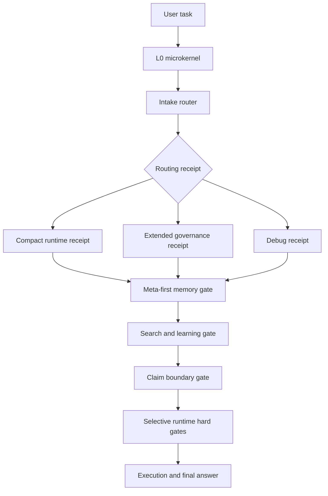

# Claim Boundary Harness

Stop coding agents from calling weak evidence "validated." Claim Boundary Harness adds meta-first routing, project-scoped memory lanes, R0-R5 risk receipts, and deployment adapters for claim verification.

Current version: `v0.14.12`

It is not tied to one agent runtime. It is a neutral starting point that can be mapped into any agent that can read workspace instructions, run local scripts, use command or skill folders, or call hooks before tools.

## Start Here

- Want the short problem statement? Read [What Problem It Solves](#what-problem-it-solves).
- Want the architecture first? Start with [Architecture At A Glance](#architecture-at-a-glance), then read [docs/architecture.md](docs/architecture.md).
- Want to adapt it into an agent runtime? Use [Quick Start](#quick-start) and [docs/adoption.md](docs/adoption.md).
- Need hook, wrapper, or runtime troubleshooting? Use [docs/deployment-risk-patterns.md](docs/deployment-risk-patterns.md), then the relevant integration page under [docs/integrations](docs/integrations).
- Want concrete record shapes? Open [Concrete Examples](#concrete-examples) and the templates under [templates](templates).

## Architecture At A Glance



## Important Adoption Notes

- **Codex field-use boundary:** this framework has been tried in one private Codex-based project workflow. That early use suggests the routing chain can persist across new conversations when the root instruction file, harness policy, project registry, and skill tree are installed, but it has not yet been broadly validated across many projects or many agent runtimes.
- **Independent project lanes:** separate projects can run separate local chains. With clear global routing boundaries, each project keeps its own instructions, memory roots, and progress records, which reduces silent memory bleed and cross-project contamination.
- **Mandatory advisory control plane:** nontrivial tasks must create a lightweight routing receipt, re-evaluate only on trigger events, and final-check claim/memory/search boundaries without wrapping every tool call.
- **Silent-by-default risk classification:** R0-R5 is always computed internally, but user-facing replies and prompt-stage hook context show it only when it changes execution path, cost, permission, memory, search, or claim boundaries. Debug/audit requests can expose the full receipt.
- **Receipt profiles:** the router computes the full decision internally but can expose a compact runtime receipt only when action-changing fields are needed, expanding for governance, public/private, projectization, memory-write, or debug cases.
- **Router decision contract:** the router and dynamic decision layer use a compact receipt to decide target surface, audience, ambiguity, module need, memory need, external need, and claim risk before opening deeper context.
- **Declarative governance contract:** adapters can declare the minimum stages, receipt fields, denial semantics, payload safety boundary, and cost profile they must honor without adding a heavy runtime framework.
- **Version compatibility manifest:** adapters can record the exact runtime version, hook schema, wrapper paths, denial behavior, payload-safety checks, bypass surfaces, and drift policy that were actually checked.
- **Memory routing contract:** the router decides whether memory should be skipped, read, written, or updated; it also decides the lane before opening memory payloads.
- **Conversation memory lane:** long-running projectless conversations can get their own isolated memory lane when explicitly requested or when checkpoint signals accumulate. This prevents context-compression loss without mixing the conversation into project or global memory.
- **Memory linking contract:** project, conversation, and archive memories use stable IDs, `updated_at`, index-level retrieval terms, and append-only link ledgers so new conversations can continue old ones without polluting old memory. Explicit merges create a new merged memory.
- **Conversation-link gate:** continuation, merge, archive, and cross-conversation memory tasks must resolve the link decision through meta-first lookup before the first protected tool call when the host supports hooks, wrappers, or tool proxies.
- **Cost control contract:** complete governance stays available internally, but the default path emits the smallest action-relevant receipt and uses delta receipts after trigger events.
- **Projectization drift detection:** projectless conversations that accumulate repository, versioning, docs, tests, adapters, release, or architecture-decision signals can be flagged as emergent project candidates.
- **Format layering:** human-facing docs stay in Markdown, but machine-owned routing facts, append-only records, and large tables should move to JSON, JSONL, CSV/TSV, or SQLite-style stores so agents do not rely on fragile Markdown tables and long lines.
- **Archive and persona boundaries:** optional global archive is a cold index, not active memory; archive defaults to move/copy, while persona state is conversation-only and cannot affect work decisions.
- **Source-grounded search and learning:** current facts, GitHub/open-source review, unfamiliar mechanisms, and anti-closed-door-invention tasks are split into official-source search, repository inspection, general web cross-check, source-grounded intake, and local validation.
- **SkillOpt-style training layer:** recurring skill improvements can be staged as candidate edits, gated with regression probes, recorded as rejected edits when unsafe, or promoted through slow updates without replacing the bounded multi-skill matrix.
  Invoke it only for recurring skill or router improvements, candidate rule edits, rejected-edit review, slow updates, or external skill-optimization mechanism intake.
  Do not use it for ordinary chat, one-off fixes, direct memory writes, external fact checks, runtime enforcement, or tasks already handled by the router, memory gate, research gate, or claim gate.
- **Selective hook/wrapper/tool proxy runtime:** only critical boundaries such as R5, high-risk tools, low-confidence routes, long-term memory writes, and final strong claims need hard stops.
- **Meta-first memory retrieval:** memory lookup is not a direct file dive. The required chain is meta summary or `_META_INDEX`, then category or point index, then only the matching capsule or paired record.
- **Multi-axis memory meta index:** memory libraries should expose lane, scope, category, record type, status, retrieval terms, applicability, linked modules, linked records, and staleness markers so agents can select one payload instead of scanning history.
- **Source-monitoring memory schema:** reusable memory capsules can track `source_tag`, `belief_status`, structured `confidence`, `derived_from`, observation state, and belief traces so agents can distinguish hypotheses, source priors, bounded claims, local validation, conflicts, and rejected paths.
- **No continuous skill generation by default:** the framework does not keep creating new skills automatically. Too many self-generated skills can pollute project boundaries, weaken routing discipline, and make it unclear which rule owns a task. Reusable knowledge should instead be added to a clearly registered skill knowledge library, reference pack, or tool content pack, then routed explicitly.
- **Leverage-first improvement rule:** external mechanisms are absorbed only when they reduce ambiguity, improve adapter verification, or close a real deployment gap. They must not increase ordinary-task cost, load all skills or memory by default, or turn the whiteboard core into a large runtime.
- **External optimizer boundary:** SkillOpt-style mechanisms are treated as adapted rules unless executable adoption is explicitly approved. Public benchmark claims remain source-prior until locally validated.
- **Sanitized whiteboard examples:** This public repository was sanitized before publication. Private records, local project details, machine paths, and real incident history from the original working setup are not included. The included examples are synthetic records used only to help agents and adopters understand how to adapt the framework: routing, layered memory indexes, project memory capsules, paired error/solution records, claim boundaries, and client-update drift handling.
- **Reference adapters are early:** the main scripts are PowerShell, and the four core gates also have Bash counterparts under `skills/embedded-harness/bash`. Bash scripts require `jq`. The repository also includes an experimental WorkBuddy-oriented Python runtime adapter under `integrations/workbuddy-python-runtime`. These adapters have not been fully tested across devices, operating systems, client versions, or real production loops; they are reference starting points.
- **Claude Code deployment is not yet field-validated:** the Claude Code guide is a mapping example for instruction files, hooks, wrappers, and exit-code behavior. This package has not yet completed a full deployment validation inside an installed Claude Code client. If local deployment behaves differently, use the deployment problem examples, troubleshooting runbook, and compatibility manifest to inspect the exact instruction entry, hook or wrapper surface, denial behavior, and bypass paths.
- **WorkBuddy hard enforcement requires hooks:** the WorkBuddy adapter is advisory until the adopter wires it into WorkBuddy/CodeBuddy hooks. For tool execution, start with command-tool `PreToolUse` matchers such as `Bash|PowerShell` so the hook runner can return `permissionDecision: deny` and exit code `2` before commands run. Do not patch the installed WorkBuddy app; configure the supported hook surface in the adopting workspace.
- **WorkBuddy active routing needs prompt-stage hooks:** use `UserPromptSubmit` to store the original prompt and inject compact route context before `PreToolUse` enforces tool calls. The Python hook runner sanitizes lone UTF-16 surrogate values and forces UTF-8 in the included wrappers so malformed or non-ASCII payload text does not disable routing.
- **WorkBuddy final and recording boundaries:** use a `Stop` or final-answer hook when the host exposes final text before display. Voice or recording input is routed only when the host passes transcript text; the adapter does not decode raw audio, blobs, base64 strings, or arbitrary recording files.
- **Deployment is path-specific:** every agent runtime has its own instruction, hook, wrapper, middleware, or sandbox surface. The same governance chain applies to Codex-style local harness installs, Claude-style instruction files, WorkBuddy-style hooks, and custom agent loops, but a gate is hard only on the execution path that invokes it and honors the blocked result; other paths remain advisory until separately wired and tested.
- **Agent client updates require re-adaptation:** Codex, Claude Code, and other agent clients may change paths, launchers, hook behavior, skill loading, or bundled runtimes after updates. Re-run adapter checks and smoke tests after client updates so stale paths do not silently disable the harness.

## What Problem It Solves

Modern coding agents often fail in the same places:

- They start working before deciding task risk.
- They load too much history, or the wrong project history.
- They mix memories from unrelated projects.
- They overstate partial runs as proven results.
- They skip current source checks for versioned or fast-changing facts.
- They repeat old mistakes because solved incidents are not stored in a reusable shape.
- Their instruction files, skills, and local checks are not connected into one clear path.

This project gives those pieces a simple shared structure.

```text
user request
-> root microkernel
-> intake router R0-R5
-> mandatory advisory control plane
-> lightweight routing receipt
-> event-triggered re-evaluation
-> only needed gates
-> project instructions and memory boundary
-> conversation memory lane when projectless long-chat signals require it
-> execution
-> final answer with evidence limits
-> optional paired error and solution records
```

## What It Implements

- **Root microkernel**: the small always-on rule set for language, evidence, risk, memory boundaries, and high-risk stops.
- **Intake router**: deterministic R0-R5 task classification.
- **Mandatory advisory control plane**: routing receipt, event-triggered dynamic review, and final boundary checks for skill/tool/plugin/search/memory/claim-gate decisions.
- **Receipt profile selector**: `compact_runtime` for low-cost single-agent operation, `extended_governance` for public/framework/project-boundary work, and `debug_receipt` for router diagnosis.
- **Router decision contract**: a stable low-cost receipt for target surface, audience, semantic ambiguity, module selection, memory route, external route, claim risk, and gates.
- **Declarative governance contract**: a compact adapter contract for stages, decision vocabulary, denial semantics, payload safety, and cost boundaries.
- **Version compatibility manifest**: a compact record of runtime/client version, hook schema, wrapper paths, tested denial behavior, bypass surfaces, and drift response.
- **Lightweight CI smoke workflow**: a single GitHub Actions workflow for representative reproduction checks and WorkBuddy Python adapter tests, not a full compatibility matrix.
- **Governance/routing update handling**: framework-rule, trigger-term, routing-rule, decision-matrix, and dynamic-evaluation edits are treated as R3 changes even when they are documentation-only.
- **Selective runtime enforcer scripts**: hook, wrapper, and tool-proxy entry points that return nonzero only at configured hard-stop boundaries when called by the adopting runtime. They are truly mandatory only when they are the sole execution path for the relevant agent action. The WorkBuddy Python adapter includes a hook runner for `UserPromptSubmit`, command-tool `PreToolUse`, and `Stop`/final checks.
- **Search and learning decision matrix**: routes public facts, GitHub repository evidence, general web cross-checks, external mechanism intake, and local validation boundaries.
- **Additive routing**: if a task matches more than one risk type, it keeps the highest risk label and returns the union of needed gates.
- **Memory isolation gate**: prevents accidental cross-project memory use unless the user clearly asks for it.
- **Conversation memory lane**: isolates durable state for long-running ordinary conversations that have no project lane yet.
- **Cost control contract**: keeps default execution cheap through receipt profiles, action-relevant fields, delta receipts, and active-context ceilings.
- **External research gate**: detects currentness signals such as latest, current, version, release, GitHub, and official sources.
- **Claim schema verifier**: blocks strong claims unless the claim has enough source and evidence boundary metadata.
- **Skill tree router**: routes semantic anchors, paired incident records, and project router manifests.
- **SkillOpt-style training layer**: turns recurring improvement ideas into candidate-edit packets, validation-gate reports, rejected-edit records, and slow-update proposals while leaving runtime routing authority with the existing matrix.
- **Paired improvement records**: one error record plus one solution record for each solved recurring incident.
- **Layered project memory library**: a meta index points to category indexes, and category indexes point to individual capsules.
- **Memory meta index contract**: a multi-axis index shape for project memory libraries and skill point sets.
- **Source monitoring memory schema**: provenance and belief-state fields for memory capsules, including `source_tag`, `belief_status`, structured `confidence`, `derived_from`, observation state, belief traces, and optional adapter score boundaries.
- **Common error corpus template**: lightweight CE records for small recurring field/schema, tool-call, semantic-routing, patch-context, PowerShell/path, and Git-boundary mistakes, including the applied solution and validation, before they become full paired incidents.
- **Whiteboard templates**: empty project memory categories, project instructions, semantic anchors, and error/solution ledgers.

## Repository Layout

```text
.
+-- AGENTS.md
+-- CHANGELOG.md
+-- PROJECT_SKILL_MATRIX_REGISTRY.md
+-- VERSION
+-- .github/
|   +-- workflows/
|       +-- smoke.yml
+-- docs/
|   +-- adoption.md
|   +-- architecture.md
|   +-- examples.md
|   +-- declarative-governance-contract.md
|   +-- version-compatibility-management.md
|   +-- integrations/
|   +-- memory-meta-index-contract.md
|   +-- source-monitoring-memory-schema.md
|   +-- memory-routing-contract.md
|   +-- common-error-corpus.md
|   +-- conversation-memory-lane.md
|   +-- memory-linking-contract.md
|   +-- format-layering.md
|   +-- cost-control-contract.md
|   +-- archive-and-persona-boundaries.md
|   +-- non-goals.md
|   +-- reproduction.md
|   +-- router-decision-contract.md
+-- integrations/
|   +-- workbuddy-python-runtime/
+-- examples/
|   +-- sample-routing.md
|   +-- memory-capsule-examples.md
|   +-- memory-library-demo/
+-- skills/
|   +-- agent-error-memory/
|   +-- bug-solution-memory/
|   +-- embedded-harness/
|   |   +-- bash/
|   |   +-- validate_policy.ps1
|   |   +-- harness_runtime_enforcer.ps1
|   |   +-- harness_task_wrapper.ps1
|   |   +-- harness_tool_proxy.ps1
|   +-- shared-semantic-anchors/
|   +-- skillopt-training-layer/
|   +-- troubleshooting-skill-matrix/
+-- templates/
    +-- adapter-contract/
    +-- common-error-corpus/
    +-- conversation-memory/
    +-- global-memory-archive/
    +-- project/
```

## Where It Can Be Used

This framework can be adapted to agents that support one or more of these surfaces:

- workspace instruction files;
- project instruction files;
- command or skill folders;
- local script execution;
- tool-call hooks;
- project memory folders;
- wrapper scripts around the agent process.

If an agent only reads instruction files, this framework acts as a soft workflow contract. If an agent also supports hooks or wrappers, the gate scripts can become stronger runtime checks.

Integration examples are intentionally small and conservative:

- [docs/integrations/codex.md](docs/integrations/codex.md)
- [docs/integrations/claude-code.md](docs/integrations/claude-code.md)
- [docs/integrations/workbuddy.md](docs/integrations/workbuddy.md)
- [integrations/workbuddy-python-runtime/README.md](integrations/workbuddy-python-runtime/README.md)

## Why Skills Are Bounded

This framework treats skills as routed, reviewable capabilities rather than an unlimited self-growing pile. The default chain is:

```text
small root rules
-> task risk route
-> selected project lane
-> selected skill or knowledge pack
-> execution and claim boundary
-> optional paired improvement record
```

New skills should be created only when they remove real repeated work and have a clear scope, owner, retrieval surface, and non-applicable boundary. Routine facts, solved incidents, examples, and reference notes can live in memory capsules or knowledge packs without becoming new active skills.

## Mandatory Advisory Control Plane

For nontrivial tasks, the framework requires a low-cost control plane:

```text
routing receipt
-> execute the cheapest sufficient route
-> event-triggered re-evaluation
-> final claim, memory, version, and verification boundary check
-> selective runtime hard gate only for critical risks
```

The routing receipt should decide:

- task type and active lane;
- target surface and intended audience;
- risk level and required gates;
- semantic ambiguity and terms that need anchoring;
- project instructions or project router;
- memory retrieval and memory isolation;
- an existing skill, tool, plugin, or adapter;
- external research for current or drift-prone facts;
- claim-schema or evidence-boundary checks;
- human confirmation for high-risk actions.

See [docs/router-decision-contract.md](docs/router-decision-contract.md) for the exact receipt fields and low-cost expansion rule.

See [docs/memory-routing-contract.md](docs/memory-routing-contract.md) for how the router chooses memory mode, memory lane, record intent, and projectization review.

Re-evaluation is event-triggered, not continuous. Trigger events include new evidence, missing files, tool errors, scope changes, user corrections, cross-project terminology, version/currentness claims, GitHub/open-source mechanism intake, cost escalation, risk escalation, strong claims, R5 actions, or memory writes.

This control plane is mandatory, but it is not a reason to load every skill, every memory file, or wrap every tool call. If the control plane is skipped or cannot be completed, the final answer must say so and must not present the result as fully verified.

## Mandatory Search And Learning Decision Matrix

The framework treats external research as a routed workflow, not a vague instruction to search. Use this matrix when the task involves current facts, public products, policy, law, price, version, release data, GitHub/open-source repositories, unfamiliar mechanisms, architecture comparison, or avoiding closed-door invention.

| Route | Use when | Boundary |
| --- | --- | --- |
| Official / authority source search | Drift-prone public facts such as product, institution, policy, law, price, version, release date, or named role | Prefer official or authority sources first; cross-check when practical. |
| GitHub / open-source repository search | Repository intent, source tree, release notes, issues, changelog, license, project activity, or examples | Separate README claims, code facts, release or issue evidence, and license boundaries. |
| General web cross-check | Ecosystem trend, mechanism comparison, third-party guide, community experience, or uncertain public claim | Use independent sources when practical; mark source limits when not. |
| Source-grounded learning intake | Learn-from-open-source tasks, external mechanism review, architecture comparison, or anti-closed-door-invention work | Build a source ledger and classify material before adapting it. |
| Local validation route | Strong adoption, success, performance, or compatibility claims | Require local files, scripts, tests, reproduction, or a concrete evidence chain. |

Outside material should be classified as `fact`, `source_prior`, `hypothesis`, `inspiration`, `unverified_implementation_path`, or `not_applicable`. Reading external material can guide the work, but it is not local validation by itself.

## Mandatory Meta-First Memory Lookup

For nontrivial memory retrieval, the framework requires this order:

```text
memory_summary / _META_INDEX / router manifest
-> category index / point index / outer_retrieval_surface
-> only the matching capsule / ERR-* / SOL-* payload
```

This rule is important because direct deep reads recreate the same context-bloat problem that the framework is meant to prevent. If a project has not adopted a meta index yet, use the smallest available top-level index as a temporary meta layer, note the adaptation gap, and do not scan the whole memory tree unless the task is explicitly a full audit.

See [docs/memory-meta-index-contract.md](docs/memory-meta-index-contract.md) for the recommended meta index fields, category index shape, and default retrieval budget.

For lightweight recurring execution mistakes, use [docs/common-error-corpus.md](docs/common-error-corpus.md) and the template under [templates/common-error-corpus](templates/common-error-corpus). A CE record should preserve both the error and the solution: symptom, cause, applied fix, prevention, validation, and evidence before upgrading the issue into paired ERR/SOL records.

## Field Use Note

This framework has been tried in one private Codex-based project workflow. Once the root instruction file, harness policy, project registry, and skill tree are in place, that early use suggests new conversations can continue to follow the same routing chain instead of rediscovering the workflow from scratch.

This is not yet broad field validation. The public package has not been battle-tested across many projects, many operators, or many agent runtimes.

The PowerShell, Bash, and WorkBuddy Python adapters are also not complete compatibility claims.
They were adapted from one local device environment. PowerShell and the WorkBuddy Python decision layer were smoke-tested locally; the Bash/mac-style scripts are reference adapters and still need target-shell verification on the adopter's machine.
The WorkBuddy Python adapter now includes a hook runner tested through local unit tests, including prompt routing, command-tool denial, Stop/final claim checks, and transcript extraction.
Real hard enforcement still depends on the adopter's WorkBuddy version honoring hook denial, exit code `2`, final-hook blocking, and the configured matcher scope.

The Claude Code integration page is currently a reference mapping, not a completed client-deployment validation. Adopters should confirm which instruction file the installed client reads, whether a pre-tool or command hook exists, whether blocked results are honored, and which surfaces can bypass the wrapper. If any of those checks fail, follow the deployment troubleshooting guide and let the adopting agent localize the problem before claiming hard enforcement.

Receipt profile behavior is covered by the current reproduction checks and WorkBuddy Python adapter tests. Bash and macOS/Linux reference paths still need target-shell verification on the adopter's machine.

It also supports independent project lanes. After global routing boundaries are configured, each project can keep its own instructions, memory roots, and incident records. That makes it possible to run separate local chains for separate projects without silent memory bleed, cross-project contamination, or unrelated progress records being mixed together.

## Concrete Examples

The package includes synthetic examples that show the intended record shapes without exposing any private project history:

- [examples/sample-routing.md](examples/sample-routing.md): routing examples for mixed risk and vague tasks.
- [examples/memory-capsule-examples.md](examples/memory-capsule-examples.md): project memory capsule, paired error/solution records, claim boundary record, and client-update drift record.
- [examples/memory-library-demo/_META_INDEX.md](examples/memory-library-demo/_META_INDEX.md): layered memory library demo using meta index, category indexes, capsule status, and supersession.
- [docs/router-decision-contract.md](docs/router-decision-contract.md): router and dynamic decision receipt contract.
- [docs/articles/claim-boundary-harness-design.md](docs/articles/claim-boundary-harness-design.md): design note covering claim boundaries, meta-first routing, memory lanes, runtime enforcement limits, deployment pitfalls, and reproduction scope.
- [docs/declarative-governance-contract.md](docs/declarative-governance-contract.md): small adapter governance contract for stages, denial semantics, payload safety, and cost boundaries.
- [docs/version-compatibility-management.md](docs/version-compatibility-management.md): runtime/client compatibility manifest and drift response rules.
- [docs/memory-routing-contract.md](docs/memory-routing-contract.md): memory mode, memory lane, record intent, and projectization drift contract.
- [docs/memory-meta-index-contract.md](docs/memory-meta-index-contract.md): multi-axis meta index contract for memory libraries.
- [docs/source-monitoring-memory-schema.md](docs/source-monitoring-memory-schema.md): source tags, belief-status state, structured confidence, derived provenance, observation state, and belief-trace rules for capsules.
- [docs/common-error-corpus.md](docs/common-error-corpus.md): lightweight common-error sample format.
- [docs/conversation-memory-lane.md](docs/conversation-memory-lane.md): isolated memory lane for long-running projectless conversations.
- [docs/memory-linking-contract.md](docs/memory-linking-contract.md): stable memory IDs, timestamps, link-only continuation, explicit merge, and fuzzy lookup rules.
- [docs/format-layering.md](docs/format-layering.md): when to use Markdown, JSON, JSONL, CSV/TSV, SQLite, or generated Markdown.
- [docs/cost-control-contract.md](docs/cost-control-contract.md): routing field budgets, delta receipts, active-context ceilings, and action-relevant field rules.
- [docs/archive-and-persona-boundaries.md](docs/archive-and-persona-boundaries.md): optional cold archive, move/copy archive defaults, summary capsule exceptions, and conversation-only persona boundaries.
- [docs/deployment-risk-patterns.md](docs/deployment-risk-patterns.md): common deployment failures, concrete issue examples, and solution playbooks for WorkBuddy-like hooks, CLI agents, IDE agents, custom orchestrators, hosted agents, and wrapper-only setups.
- [docs/examples.md](docs/examples.md): expected gate behavior and how to interpret examples.

## Quick Start

1. Copy this package into a new workspace.
2. Open `AGENTS.md` and keep only the rules that match your workflow.
3. Edit `skills/embedded-harness/embedded_harness_policy.json`.
4. Replace `EXAMPLE_PROJECT` and `C:\\path\\to\\project` with your project lane and memory roots.
5. Register the skill folders using whatever skill or command mechanism your agent supports.
6. Run the intake router before nontrivial work.

```powershell
powershell -ExecutionPolicy Bypass -File .\skills\embedded-harness\harness_intake_router.ps1 -TaskText "fix the script and run benchmark" -Cwd "C:\path\to\project"
```

Validate the policy after editing it:

```powershell
powershell -ExecutionPolicy Bypass -File .\skills\embedded-harness\validate_policy.ps1
```

On Bash environments with `jq`:

```bash
bash ./skills/embedded-harness/bash/validate_policy.sh
bash ./skills/embedded-harness/bash/harness_intake_router.sh --task-text "fix the script and run benchmark" --cwd "/path/to/project"
```

After any agent client update, re-check the adapter surface before relying on the chain:

```text
1. Confirm the root instruction file is still loaded.
2. Confirm command, skill, hook, or wrapper paths still exist.
3. Run the intake router on a mixed-risk task.
4. Run the memory isolation gate on an allowed and a blocked path.
5. Run a claim verifier smoke check before publishing strong factual claims.
```

## Local Reproduction

The whiteboard package was smoke-tested locally with:

- intake routing for a mixed fix plus benchmark task;
- fallback classification for vague project work;
- memory isolation for an example project memory folder;
- blocked memory isolation for a sibling prefix path;
- trigger word-boundary and negation checks;
- external research trigger checks;
- external research negation checks;
- claim schema verification;
- policy validation;
- Bash smoke checks when `jq` is available;
- WorkBuddy Python adapter unit tests as a standalone decision layer, including prompt routing, command blocking, Stop/final claim blocking, surrogate-safe payloads, recording transcript extraction, and non-command file-content false-positive guards;
- package content scan for local project terms and sensitive field names.

See [docs/reproduction.md](docs/reproduction.md) for commands and expected results.

## Recommended First Customizations

- Rename `EXAMPLE_PROJECT` to your project lane.
- Replace placeholder memory roots.
- Copy `templates/conversation-memory/` only for long-running projectless conversations that need a checkpoint lane.
- Add one project instruction file under `templates/project/`.
- Keep the error and solution memory files empty until a real solved incident exists.
- Add only user-confirmed semantic anchors.
- Add wrapper or hook integration only after the basic scripts run in your environment.
- Review [docs/non-goals.md](docs/non-goals.md) before adding packaging, dashboards, broad comparison tables, or community-maintenance boilerplate.

## Limitations

This is a foundation package, not a complete safety system.

- The scripts are not a hard sandbox.
- A blocked result only works when the calling agent or wrapper honors it.
- A wrapper is truly mandatory only if it is the only command or tool execution path for the agent action it protects. If users or tools can bypass it, the framework remains advisory for that path.
- Most gates are intentionally advisory: they return structured decisions for the caller to honor. They become real interception only on execution paths where `harness_task_wrapper.ps1`, `harness_tool_proxy.ps1`, or an equivalent hook is the only way the agent can run the protected action.
- The trigger lists are intentionally small and should be tuned.
- The memory format is a template, not a database.
- Different agents need different adapter files and launch methods.
- The Claude Code guide is a reference mapping and has not yet been fully deployment-validated in an installed Claude Code client.
- The WorkBuddy Python adapter is experimental and is not a complete WorkBuddy compatibility guarantee.
- Bash/macOS/Linux support is a reference path until it is tested on the target machine and shell.
- There are likely missing cases, rough edges, and workflows we have not considered.

## Feedback Welcome

If you try this in another agent runtime, a different operating system, or a different project workflow, feedback is welcome. Useful feedback includes:

- unclear rules;
- missing risk categories;
- better trigger terms;
- better memory capsule shape;
- examples of hook integration;
- failure cases where the router chose the wrong path.

The goal is a simple reusable chain that helps agents stay scoped, honest, and easier to audit.
