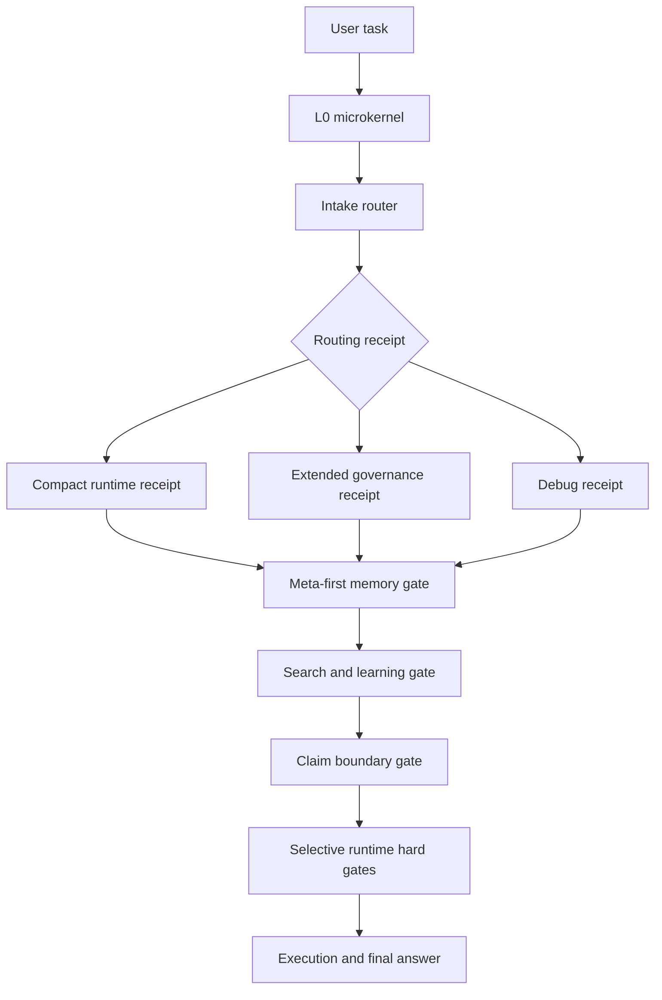

[中文版](./README_zh.md) | English

# Claim Boundary Harness

[](https://github.com/qimen039-code/claim-boundary-harness/actions/workflows/smoke.yml)
[](https://doi.org/10.5281/zenodo.21189880)

Claim Boundary Harness (CBH) is an external cognition governance harness for
agent workflows. It provides claim verification, memory continuity, risk
routing, correction accumulation, and adapter contracts as structural
enforcement, not advisory prompts.

Current version: `v0.19.5`

Citation and attribution: if you use, adapt, evaluate, or productize CBH,
please cite this repository with `CITATION.cff` and retain `NOTICE.md` plus the
MIT license notice. The archived DOI is
[10.5281/zenodo.21189880](https://doi.org/10.5281/zenodo.21189880).

The project exists to make capable agents more reliable without replacing the
model, training a new model, or forcing every task through a heavy memory
backend. CBH keeps the leverage small: route first, open only the needed memory
or evidence window, preserve source boundaries, and stop high-risk actions or
strong claims only when the adopting runtime exposes a real interception point.

It is designed to improve with real use. Repeated mistakes, adapter drift,
memory pollution, and routing gaps should become bounded records, tests, or
small policy updates. They should not become an uncontrolled pile of active
skills, prompts, or summaries that slowly pollute the model context.

It is not tied to one agent runtime. It is a neutral starting point that can be
mapped into any agent that can read workspace instructions, run local scripts,
use command or skill folders, or call hooks before tools.

CBH is not:

- a vector database or semantic-memory backend;
- a replacement for the host model's reasoning ability;
- a broad safety sandbox;
- a prompt-only style guide;
- a guarantee that every client can hard-block tools.

The public package is a framework and reference implementation. Actual
enforcement strength depends on the host runtime, hook surface, local project
lane configuration, and verification tests run by the adopter.

## At A Glance

Claim Boundary Harness is a small external cognition layer for coding agents.
This repository already contains:

- routing receipts and R0-R5 risk handling before work starts;
- project, conversation, common-error, archive, and static-knowledge lane boundaries;
- source-preserving memory capsules, conversation ledgers, and link-only continuation records;
- claim, causal-attribution, external-research, reading, feedback-loop, debt-hygiene, and skill-lifecycle contracts;
- PowerShell reference gates plus Bash, WorkBuddy, Doubao, and Codex-oriented adaptation notes;
- tests, smoke checks, examples, credits, and reproduction notes for the parts that can be checked automatically.

The README is the public orientation layer for people and for agents doing a
quick first pass. Runtime behavior lives in `AGENTS.md`, the embedded policy,
gate scripts, adapter contracts, templates, and the detailed files under
`docs/`.

Fast paths:

| Need | Start here |
| --- | --- |
| Understand the problem | [What Problem It Solves](#what-problem-it-solves) |
| See the architecture | [Architecture At A Glance](#architecture-at-a-glance) |
| Install or adapt | [Quick Start](#quick-start), [docs/adoption.md](docs/adoption.md) |
| Validate behavior | [docs/test-cases.md](docs/test-cases.md), [docs/reproduction.md](docs/reproduction.md) |
| Cite or review provenance | [CITATION.cff](CITATION.cff), [NOTICE.md](NOTICE.md), [docs/influences-and-attribution.md](docs/influences-and-attribution.md) |
| Runtime troubleshooting | [docs/deployment-risk-patterns.md](docs/deployment-risk-patterns.md), [docs/integrations](docs/integrations) |

## Capability Map

| Capability | Primary entry point | Current public status |
| --- | --- | --- |
| Routing and claim gates | `harness_intake_router.ps1`, `harness_claim_schema_verifier.ps1` | Tested script contracts |
| Runtime hard stops | `harness_runtime_enforcer.ps1`, `harness_tool_proxy.ps1`, `harness_task_wrapper.ps1` | Hard only on host-called paths |
| Policy and adoption checks | `compile_policy_from_toml.py`, `validate_policy.ps1`, `tools/cbh_doctor.py` | Drift and preflight checks |
| WorkBuddy adapter | `integrations/workbuddy-python-runtime/` | Unit-tested reference adapter; adopter must verify hook wiring |
| Memory lanes and ledgers | `templates/project/memory-library/`, `templates/conversation-memory/`, `codex_session_ledger.py` | Templates and evidence indexes |
| Retrieval and reading | `docs/hybrid-memory-retrieval-contract.md`, `docs/content-reading-contract.md` | Meta-first, source-preserving, bounded windows |
| Skill lifecycle | `docs/skill-lifecycle-contract.md`, `templates/skill-lifecycle/` | Active-frame plus release receipt |
| Feedback and causal review | `docs/memory-feedback-loop-trial.md`, `docs/router-decision-contract.md` | CE reuse plus overclaim boundary |

## Architecture At A Glance



## What CBH Adds

Most agent memory or harness projects cover one slice: prompt rules, memory
storage, hooks, retrieval, or test receipts. Claim Boundary Harness connects
those slices into one low-cost contract:

- **Claim boundary:** weak evidence stays `source_prior` or `bounded_claim`
  until local checks justify promotion.
- **Memory without bleed:** project, conversation, common-error, archive, and
  static-knowledge lanes can link to each other without silent payload mixing.
- **Conversation ledger:** raw host session logs can be indexed into lightweight
  session, turn, segment, time-anchor, and evidence-ref records before memory
  rollup.
- **Metadata-bearing retrieval:** returned context must carry these fields:
  `source_tag` `derived_from` `belief_status` `confidence` `score_method`.
- **Source-preserving memory writes:** reusable capsules should contain
  context-complete content in the original source language, with stable English
  structure fields for machine parsing. The router exposes
  `memory_write_profile` for durable writes so this remains a selected write
  constraint, not an always-on rewrite job.
- **Hybrid memory retrieval:** lookup is meta-first, lane-scoped, and
  source-preserving; exact terms, original-language keywords, Chinese character
  n-grams, English terms, and optional lexical ranking are bounded by indexes
  before any payload is opened. The router exposes
  `hybrid_retrieval_profile` only as an enhancement over the existing
  meta-first chain, not as an independent replacement search stack.
- **Bounded source reading:** after retrieval selects a candidate, identify the
  source shape, read the smallest useful evidence window, add a source context
  header, use middle-safe evidence layout only when routed, and report unread
  zones or verification debt.
- **Causal attribution boundary:** observation-scope routing and draft-final
  review keep local observations, case examples, hypotheses, mechanism
  properties, and validated causality from being silently mixed.
- **Skill lifecycle control:** idle skills stay at name/meta-summary level;
  active skill phases load only needed bodies and support files; completed
  phases leave a compact `skill_release_receipt` for audit and reactivation
  instead of relying on long-lived rendered skill text.
- **Bounded improvement, not skill pileup:** recurring mistakes can become
  `CE-*`, `ERR-*` / `SOL-*`, feedback-loop calibration, or candidate
  SkillOpt-style edits, but each path keeps scope, validation, and rejection
  boundaries. The goal is an agent that gets more practiced in the current
  workflow, not a heavier context that degrades over time.
- **Hallucination drift control, not hallucination removal:** source-tagged
  memory, bounded reading windows, external-source routing, causal-attribution
  review, and final claim checks are intended to reduce unchecked drift and
  cross-conversation accumulation. They are not a claim that the model cannot
  hallucinate.
- **Selective hard gates:** R5 actions, risky tools, unresolved memory links,
  and strong final claims can be blocked when the runtime calls the gate.
  Single-event R5 permits are hash-bound and recorded in a used-ledger after a
  concrete tool event passes, so the same permit cannot be replayed.

Some mechanisms are adapted from public projects and established engineering
patterns. See [NOTICE.md](NOTICE.md),
[docs/influences-and-attribution.md](docs/influences-and-attribution.md),
`CREDITS.toml`, and `CITATION.cff`.

## Memory Lanes Without Memory Bleed

The memory design is not just "save more context." It is a lane-and-link system
that lets agents recover prior context without turning every memory into one
shared pool.

The core rule:

```text
separate memory lanes
-> meta-first lookup
-> explicit link edges between lanes
-> lane-scoped writes by default
-> metadata-bearing retrieval results
```

The framework separates project memory, conversation memory, common-error
records, self-reflection records, and optional global archive indexes. Those
lanes can point to each other through `memory_links.jsonl`, `references.jsonl`,
`supersession.jsonl`, `archive_index.jsonl`, stable `memory_id` values, and
`derived_from` provenance. The link tells the agent where related context
exists; it does not automatically copy the other lane's payload into the current
lane.

That gives three useful behaviors at the same time:

- **Project continuity:** a project can keep its own meta index, category
  indexes, capsules, errors, solutions, and open loops without being mixed with
  other projects.
- **Conversation continuity:** a long ordinary chat can get its own isolated
  conversation memory lane before it becomes a project. A later conversation can
  continue from it through a link-only edge.
- **Cross-lane discovery without silent contamination:** a lane may reference
  another lane, but cross-lane payload reads, writes, merges, or archive actions
  require explicit routing decisions and, when needed, user confirmation.

Continuation is link-only by default:

```text
old conversation memory meta
-> new conversation memory with its own memory_id
-> bounded summary_snapshot from the old meta/current-state summary
-> append continuation link old -> new
-> write new durable state only to the new lane
```

For raw host logs, the framework adds a conversation-ledger layer:

```text
raw session JSONL
-> conversation ledger with lossless-enough evidence pointers
-> project memory or long-conversation memory rollup
```

The ledger is a derived index, not another source of truth. Client-compacted
summaries and segment summaries are navigation only. Exact user wording,
decisions, code diffs, tests, external-source claims, R5 confirmations, and
memory links should be recovered through `evidence_refs.jsonl` pointers back to
raw sessions or artifacts. Meta-summary routing and event/domain capsules are
preserved as compatible views through `_LEDGER_INDEX.md`, `domain_index.json`,
and `capsules.jsonl`.

Explicit merges create a new merged memory and mark the old memories as sealed
or redirected. The old payloads remain auditable unless the user separately
requests deletion or redaction.

Retrieval also stays bounded. A memory result should not be returned as a plain
paragraph that "looks relevant." Required reusable-memory fields:
`source_tag` `derived_from` `belief_status` `confidence` `score_method`.
If a retrieval backend has no numeric score, it should use `score_method: none`
and omit `score`. This keeps source, provenance, belief state, and ranking
separate.

Memory writes also stay source-preserving. Durable capsules should not be
isolated short notes; they should include enough subject, action, object, scope,
time, provenance, and non-applicable boundary to remain clear after context
compaction. The structure fields stay English for adapter stability, while
memory content keeps its original language.

Reading remains a separate step from retrieval. A retrieved snippet, ledger
capsule, generated summary, or rank score can select a source, but it does not
prove that the source has been read. The reading contract opens bounded
evidence windows, records unread zones when coverage is partial, and can mark
`position_risk` when head/tail reading is not enough to support a strong claim.
The routing or decision layer should pick the smallest sufficient reading
profile: `baseline`, `evidence_window`, `middle_safe`, or `full_audit`.

The result is an interlinked memory system that can find related project or
conversation context while still preventing default cross-project,
cross-conversation, or archive-to-active memory bleed.

## Reality Check

- Reference path: PowerShell scripts. Bash and Python adapters are starting points.
- Hard blocking works only on execution paths that actually call and honor the gates.
- Client updates can break instruction paths, hooks, runtimes, or skill loading; rerun smoke checks after updates.
- No memory backend is required. Add one only if it preserves lane isolation and provenance metadata.
- Public examples are synthetic; private project records are intentionally not included.

See [docs/adoption.md](docs/adoption.md) and
[docs/deployment-risk-patterns.md](docs/deployment-risk-patterns.md) for the
long-form deployment notes.

## What Problem It Solves

Modern coding agents often fail in the same places:

- They start working before deciding task risk.
- They load too much history, or the wrong project history.
- They mix memories from unrelated projects.
- They overstate partial runs as proven results.
- They keep detouring when their internal knowledge or current context cannot solve the problem efficiently, instead of proactively searching or checking external sources.
- They repeat old mistakes because solved incidents are not stored in a reusable shape.
- Their `AGENTS.md`, skills, memory lanes, hooks, and related governance surfaces are not connected into one closed loop.

This project gives those pieces a simple shared structure.

```text
user request
-> root microkernel
-> intake router R0-R5
-> mandatory advisory control plane
-> lightweight routing receipt
-> event-triggered re-evaluation
-> only needed gates
-> project instructions and memory boundary
-> conversation memory lane when projectless long-chat signals require it
-> execution
-> final answer with evidence limits
-> optional paired error and solution records
```

## What It Implements

The implementation is split by surface so adopters can use only the pieces
their runtime can actually honor:

- **Public orientation:** README files, examples, credits, reproduction notes,
  and integration pages. These explain the framework; they are not the runtime
  policy source.
- **Agent control plane:** root microkernel, intake router, receipt profiles,
  additive R0-R5 routing, governance contracts, and policy TOML/JSON. This is
  mandatory as a decision chain, but cheap by default through compact and delta
  receipts.
- **Runtime interception:** PowerShell runtime enforcer, tool proxy, task
  wrapper, Bash references, and WorkBuddy hook runner. These are hard only on
  paths where the host actually calls and honors the gate.
- **Memory continuity:** project memory library, conversation memory lane,
  raw-session ledger, memory links, static knowledge layer, meta indexes, and
  source-monitoring capsule schema. This gives lane-and-link continuity without
  default cross-project or cross-conversation payload mixing.
- **Reading and verification:** content-reading profiles, external-research
  routing, claim schema verifier, causal-attribution review, test cases, and
  `cbh_doctor`. Retrieved snippets and external reading remain evidence inputs
  until local checks support stronger claims.
- **Improvement loop:** common-error corpus, paired incident records,
  feedback-loop trial fields, debt-hygiene routing, skill lifecycle receipts,
  and a default-off SkillOpt-style candidate-edit runner. Improvement is
  staged, scoped, reviewable, and rejectable; it is not always-on
  self-rewriting.

That split is deliberate. Human-facing docs describe what the package does and
where to start. Agent-facing contracts decide what to load, what to verify,
what to block, and what to record. Long-term improvement should happen through
small validated changes, sealed records, and explicit links, not through
unbounded context growth.

## Repository Layout

```text
.
+-- AGENTS.md
+-- CITATION.cff
+-- CREDITS.toml
+-- CHANGELOG.md
+-- LICENSE
+-- NOTICE.md
+-- PROJECT_SKILL_MATRIX_REGISTRY.md
+-- README_zh.md
+-- VERSION
+-- .github/
|   +-- workflows/
|       +-- smoke.yml
+-- docs/
|   +-- adoption.md
|   +-- architecture.md
|   +-- articles/
|       +-- claim-boundary-harness-design.md
|   +-- examples.md
|   +-- influences-and-attribution.md
|   +-- skillopt-runtime.md
|   +-- static-knowledge-layer.md
|   +-- test-cases.md
|   +-- declarative-governance-contract.md
|   +-- version-compatibility-management.md
|   +-- integrations/
|   +-- memory-meta-index-contract.md
|   +-- source-monitoring-memory-schema.md
|   +-- memory-write-granularity-contract.md
|   +-- memory-routing-contract.md
|   +-- hybrid-memory-retrieval-contract.md
|   +-- content-reading-contract.md
|   +-- skill-lifecycle-contract.md
|   +-- common-error-corpus.md
|   +-- common-issues-and-solutions.md
|   +-- conversation-memory-lane.md
|   +-- conversation-ledger-contract.md
|   +-- memory-linking-contract.md
|   +-- format-layering.md
|   +-- cost-control-contract.md
|   +-- archive-and-persona-boundaries.md
|   +-- non-goals.md
|   +-- reproduction.md
|   +-- router-decision-contract.md
+-- integrations/
|   +-- workbuddy-python-runtime/
+-- tests/
|   +-- test_credits.py
|   +-- test_codex_session_ledger.py
|   +-- test_documentation_contracts.py
|   +-- test_policy_authoring_toml.py
|   +-- test_router_contract.py
+-- examples/
|   +-- sample-routing.md
|   +-- memory-capsule-examples.md
|   +-- memory-library-demo/
+-- skills/
|   +-- agent-error-memory/
|   +-- bug-solution-memory/
|   +-- embedded-harness/
|   |   +-- bash/
|   |   +-- embedded_harness_policy.authoring.toml
|   |   +-- embedded_harness_policy.json
|   |   +-- embedded_harness_policy.local.example.json
|   |   +-- compile_policy_from_toml.py
|   |   +-- validate_policy.ps1
|   |   +-- harness_runtime_enforcer.ps1
|   |   +-- harness_task_wrapper.ps1
|   |   +-- harness_tool_proxy.ps1
|   |   +-- codex_session_ledger.py
|   +-- shared-semantic-anchors/
|   +-- skillopt-training-layer/
|   +-- troubleshooting-skill-matrix/
+-- tools/
|   +-- cbh_doctor.py
|   +-- skillopt/
|       +-- skillopt_cycle.py
+-- templates/
    +-- adapter-contract/
    +-- common-error-corpus/
    +-- conversation-memory/
    +-- conversation-ledger/
    +-- global-memory-archive/
    +-- skill-lifecycle/
    +-- skillopt/
    +-- static-knowledge-layer/
    +-- project/
```

## Where It Can Be Used

This framework can be adapted to agents that support one or more of these surfaces:

- workspace instruction files
- project instruction files
- command or skill folders
- local script execution
- tool-call hooks
- project memory folders
- wrapper scripts around the agent process

If an agent only reads instruction files, this framework acts as a soft workflow contract. If an agent also supports hooks or wrappers, the gate scripts can become stronger runtime checks.

Integration examples are intentionally small and conservative:

- [docs/integrations/codex.md](docs/integrations/codex.md)
- [docs/integrations/claude-code.md](docs/integrations/claude-code.md)
- [docs/integrations/workbuddy.md](docs/integrations/workbuddy.md)
- [docs/integrations/doubao.md](docs/integrations/doubao.md)
- [integrations/workbuddy-python-runtime/README.md](integrations/workbuddy-python-runtime/README.md)

## Why Skills Are Bounded

This framework treats skills as routed, reviewable capabilities rather than an unlimited self-growing pile. The default chain is:

```text
small root rules
-> task risk route
-> selected project lane
-> selected skill or knowledge pack
-> execution and claim boundary
-> optional paired improvement record
```

New skills should be created only when they remove real repeated work and have a clear scope, owner, retrieval surface, and non-applicable boundary. Routine facts, solved incidents, examples, and reference notes can live in memory capsules or knowledge packs without becoming new active skills.

Skill calls also have a lifecycle. The route should keep unselected skills in
`listing_only` form, open an `active_frame_required` only for the selected
phase, and then write a compact `skill_release_receipt` when the phase ends.
That receipt carries the recovery pointers; the framework should not depend on
stale compressed skill bodies for long-running work.

## Core Rules Summary

The runtime rules live in `AGENTS.md` and the detailed contracts under `docs/`. The README keeps only the public summary:

- **Route first:** nontrivial work starts with a lightweight receipt that decides risk, active lane, memory mode, external-source need, claim risk, and required gates.
- **Expand only on triggers:** re-evaluate after new evidence, missing files, tool errors, scope changes, user corrections, current/version claims, GitHub/open-source intake, R5 actions, strong claims, or memory writes.
- **Search as a routed workflow:** current facts, explicit uncertainty, external mechanisms, and repository claims use official/authority search, GitHub inspection, general cross-check, source-grounded intake, or local validation as separate paths.
- **Separate observation from causality:** global trends, historical comparisons, and mechanism-effect claims require observation-scope review; high-risk causal or generalizing final text is downgraded unless it is a scoped empirical record, explicit causal hypothesis, mechanism property, or validated causality.
- **Read memory meta-first:** start from `_META_INDEX`, a router manifest, or another meta layer; then open one category index; then open only the selected capsule or paired record.
- **Keep memory lane-scoped:** project, conversation, common-error, and archive memories should not write into each other unless the user explicitly asks for a cross-lane action.
- **Bound cleanup debt:** when memory pollution, target pollution, dirty-tree debt, or technical debt accumulates, group it, clean the must-fix set, and mark deferred items as `candidate_technical_debt`.
- **Let small fixes become lessons:** fixed, reusable, low-risk mistakes can become lane-scoped `CE-*` common-error records; router/policy changes, high-impact incidents, public claims, and R5 actions still need human review.
- **Keep two reasoning loops separate:** feedback loops store memory -> prediction -> verification -> calibration lessons; causal-attribution review prevents empirical records, cases, or hypotheses from becoming causal proof.
- **Profile feedback-loop cost:** common-error lookup can stay at `index_hint`, CE writes at `record_candidate`, selected prevention at `prevention_review`, and explicit requests at `explicit_cycle`.
- **Bound final claims:** do not turn source-prior notes, retrieved snippets, mocks, partial runs, or single smoke tests into `validated` claims.
- **Hard-stop only critical paths:** R5 actions, high-risk tools, low-confidence routes, long-term memory writes, and strong final claims can be blocked when the adopting runtime actually calls the hook, wrapper, or tool proxy.

Detailed contracts:

- [docs/router-decision-contract.md](docs/router-decision-contract.md)
- [docs/memory-routing-contract.md](docs/memory-routing-contract.md)
- [docs/memory-meta-index-contract.md](docs/memory-meta-index-contract.md)
- [docs/source-monitoring-memory-schema.md](docs/source-monitoring-memory-schema.md)
- [docs/deployment-risk-patterns.md](docs/deployment-risk-patterns.md)
- [docs/correction-and-reflection-guide.md](docs/correction-and-reflection-guide.md)
- [docs/common-error-corpus.md](docs/common-error-corpus.md)
- [docs/common-issues-and-solutions.md](docs/common-issues-and-solutions.md)

## Field Use Boundary

The public package is a generic framework, reference implementation, synthetic example set, and reproducible test bundle. It must not contain private project names, private memory capsules, local incident histories, or even sanitized traces of one maintainer's local projects.

CBH is intended to improve inside each adopter's own local lane. Adopters should keep their project-specific memory, field notes, solved incidents, and client-specific deployment observations in private overlays or project-local files, then promote only reusable generic rules or tests back into the public package.

This is not broad field validation. Public claims are limited to repository tests, reference scripts, documented contracts, and adapter boundaries that adopters can rerun in their own environments.

Current client boundary:

- **Codex**: reference integration plus source/active harness smoke checks; rerun after client updates.
- **WorkBuddy**: Python adapter unit tests and hook-runner reference path; not a complete WorkBuddy version or platform certification.
- **Doubao**: current evidence supports only chat/workspace-scoped advisory demos, not persistent custom-skill or tool registration in the inspected desktop client.
- **Other clients**: reference mappings only until the target client, instruction surface, hook or wrapper path, denial behavior, and bypass surfaces are tested in that client.

The PowerShell, Bash, and WorkBuddy Python adapters are also not complete compatibility claims.
PowerShell and the WorkBuddy Python decision layer are covered by repository-side tests and smoke contracts; Bash/mac-style scripts are reference adapters and still need target-shell verification on the adopter's machine.
The WorkBuddy Python adapter includes a hook runner tested through local unit tests, including prompt routing, command-tool denial, Stop/final claim checks, and transcript extraction. Real hard enforcement still depends on each adopter's WorkBuddy version honoring hook denial, exit code `2`, final-hook blocking, and the configured matcher scope.

The Claude Code integration page is currently a reference mapping, not a completed client-deployment validation. Adopters should confirm which instruction file the installed client reads, whether a pre-tool or command hook exists, whether blocked results are honored, and which surfaces can bypass the wrapper. If any of those checks fail, follow the deployment troubleshooting guide and let the adopting agent localize the problem before claiming hard enforcement.

Receipt profile behavior is covered by the current reproduction checks and WorkBuddy Python adapter tests. Bash and macOS/Linux reference paths still need target-shell verification on the adopter's machine.

It also supports independent project lanes. After global routing boundaries are configured, each project can keep its own instructions, memory roots, and incident records. That makes it possible to run separate local chains for separate projects without silent memory bleed, cross-project contamination, or unrelated progress records being mixed together.

## Concrete Examples

The package includes generic synthetic examples that show the intended record shapes without exposing private project history or sanitized traces of one maintainer's local work:

- [examples/sample-routing.md](examples/sample-routing.md): routing examples for mixed risk and vague tasks.
- [examples/memory-capsule-examples.md](examples/memory-capsule-examples.md): project memory capsule, paired error/solution records, claim boundary record, and client-update drift record.
- [examples/memory-library-demo/_META_INDEX.md](examples/memory-library-demo/_META_INDEX.md): layered memory library demo using meta index, category indexes, capsule status, and supersession.
- [docs/router-decision-contract.md](docs/router-decision-contract.md): router and dynamic decision receipt contract.
- [docs/articles/claim-boundary-harness-design.md](docs/articles/claim-boundary-harness-design.md): design note covering claim boundaries, meta-first routing, memory lanes, runtime enforcement limits, deployment pitfalls, and reproduction scope.
- [docs/declarative-governance-contract.md](docs/declarative-governance-contract.md): small adapter governance contract for stages, denial semantics, payload safety, and cost boundaries.
- [docs/version-compatibility-management.md](docs/version-compatibility-management.md): runtime/client compatibility manifest and drift response rules.
- [docs/memory-routing-contract.md](docs/memory-routing-contract.md): memory mode, memory lane, record intent, and projectization drift contract.
- [docs/memory-meta-index-contract.md](docs/memory-meta-index-contract.md): multi-axis meta index contract for memory libraries.
- [docs/source-monitoring-memory-schema.md](docs/source-monitoring-memory-schema.md): source tags, belief-status state, structured confidence, derived provenance, observation state, and belief-trace rules for capsules.
- [docs/memory-feedback-loop-trial.md](docs/memory-feedback-loop-trial.md): optional memory -> prediction -> verification -> calibration fields for reusable learning records.
- [docs/memory-write-granularity-contract.md](docs/memory-write-granularity-contract.md): context-complete memory write rules and original-language content preservation.
- [docs/hybrid-memory-retrieval-contract.md](docs/hybrid-memory-retrieval-contract.md): meta-first, no-dependency hybrid retrieval with optional lexical ranking boundaries.
- [docs/content-reading-contract.md](docs/content-reading-contract.md): source-shape identification, structure-map fallback, source context headers, bounded evidence windows, and verification-debt notes.
- [docs/skill-lifecycle-contract.md](docs/skill-lifecycle-contract.md): active-frame, TTL, release-receipt, and reactivation rules for skill contexts.
- [docs/correction-and-reflection-guide.md](docs/correction-and-reflection-guide.md): how agents and humans share common-error recording, feedback loops, incident upgrades, and route-policy changes.
- [docs/static-knowledge-layer.md](docs/static-knowledge-layer.md): optional wiki-style project manual layer with source-prior retrieval boundaries.
- [docs/common-error-corpus.md](docs/common-error-corpus.md): lightweight common-error sample format.
- [docs/common-issues-and-solutions.md](docs/common-issues-and-solutions.md): reusable issue classes and applied solutions from adaptation, release, and CI work.
- [docs/skillopt-runtime.md](docs/skillopt-runtime.md): optional external SkillOpt-style candidate-edit runner and gate workflow.
- [docs/influences-and-attribution.md](docs/influences-and-attribution.md): public GitHub and engineering-pattern influences versus project contributions.
- [CITATION.cff](CITATION.cff) and [NOTICE.md](NOTICE.md): recommended citation metadata, attribution wording, and publication boundary.
- [docs/test-cases.md](docs/test-cases.md): acceptance cases for adopters to run against their own runtime.
- [docs/conversation-memory-lane.md](docs/conversation-memory-lane.md): isolated memory lane for long-running projectless conversations.
- [docs/conversation-ledger-contract.md](docs/conversation-ledger-contract.md): derived raw-session ledger with session, turn, segment, time-anchor, evidence-ref, and link records.
- [docs/memory-linking-contract.md](docs/memory-linking-contract.md): stable memory IDs, timestamps, link-only continuation, explicit merge, and fuzzy lookup rules.
- [docs/format-layering.md](docs/format-layering.md): when to use Markdown, JSON, JSONL, CSV/TSV, non-semantic operational indexes, or generated Markdown.
- [docs/cost-control-contract.md](docs/cost-control-contract.md): routing field budgets, delta receipts, active-context ceilings, and action-relevant field rules.
- [docs/archive-and-persona-boundaries.md](docs/archive-and-persona-boundaries.md): optional cold archive, move/copy archive defaults, summary capsule exceptions, and conversation-only persona boundaries.
- [docs/deployment-risk-patterns.md](docs/deployment-risk-patterns.md): common deployment failures, concrete issue examples, and solution playbooks for WorkBuddy-like hooks, CLI agents, IDE agents, custom orchestrators, hosted agents, and wrapper-only setups.
- [docs/integrations/doubao.md](docs/integrations/doubao.md): Doubao adaptation boundary notes. Treat persistent custom-skill/tool registration as unverified until the target new chat proves it; CBH is limited to chat/workspace-scoped advisory guidance there.
- [docs/examples.md](docs/examples.md): expected gate behavior and how to interpret examples.

## Quick Start

1. Copy this package into a new workspace.
2. Open `AGENTS.md` and keep only the rules that match your workflow.
3. Edit `skills/embedded-harness/embedded_harness_policy.authoring.toml` for high-churn trigger sections, then keep `embedded_harness_policy.json` in sync for runtime use.
4. For private machine-local project lanes, copy `skills/embedded-harness/embedded_harness_policy.local.example.json` to `embedded_harness_policy.local.json`, or point `CBH_PROJECT_LANES_FILE` at a private overlay file. Do not commit private local project roots into the public policy JSON.
5. Optionally fill `templates/static-knowledge-layer/` with a project map,
   entry points, conventions, and interface notes.
6. Register the skill folders using whatever skill or command mechanism your agent supports.
7. Run the intake router before nontrivial work.

```powershell
powershell -ExecutionPolicy Bypass -File .\skills\embedded-harness\harness_intake_router.ps1 -TaskText "fix the script and run benchmark" -Cwd "C:\path\to\project"
```

Validate the policy after editing it:

```powershell
python .\skills\embedded-harness\compile_policy_from_toml.py --check
powershell -ExecutionPolicy Bypass -File .\skills\embedded-harness\validate_policy.ps1
```

The TOML check verifies that the human-authored maintenance layer matches the
JSON file consumed by runtime adapters. The PowerShell validator checks policy shape and, when run from the repository package,
also checks the memory invariant that `belief_trace_summary.current_status`
matches `belief_status`.

On Bash environments with `jq`:

```bash
bash ./skills/embedded-harness/bash/validate_policy.sh
bash ./skills/embedded-harness/bash/harness_intake_router.sh --task-text "fix the script and run benchmark" --cwd "/path/to/project"
```

Run the optional SkillOpt-style external module smoke test when Python is available:

```bash
python tools/skillopt/skillopt_cycle.py self-test
```

Run the read-only adoption diagnostic before trusting a new adapter or after a
client update:

```bash
python tools/cbh_doctor.py --repo-root . --json
```

Run the parameterized contract checks when `pytest` is available:

```bash
python -m pytest tests
```

After any agent client update, re-check the adapter surface before relying on the chain:

```text
1. Confirm the root instruction file is still loaded.
2. Confirm command, skill, hook, or wrapper paths still exist.
3. Run the intake router on a mixed-risk task.
4. Run the memory isolation gate on an allowed and a blocked path.
5. Run a claim verifier smoke check before publishing strong factual claims.
```

## Local Reproduction

The whiteboard package was smoke-tested locally with:

- intake routing for a mixed fix plus benchmark task;
- fallback classification for vague project work;
- memory isolation for an example project memory folder;
- blocked memory isolation for a sibling prefix path;
- trigger word-boundary and negation checks;
- external research trigger checks;
- external research negation checks;
- claim schema verification;
- policy validation;
- Bash smoke checks when `jq` is available;
- cbh-doctor adoption diagnostics;
- pytest contract checks for the automatically verifiable `TC-xxx` route cases and machine-readable credits;
- optional SkillOpt-style external module self-test;
- WorkBuddy Python adapter unit tests as a standalone decision layer, including prompt routing, command blocking, single-event permit replay blocking, Stop/final claim blocking, surrogate-safe payloads, recording transcript extraction, and non-command file-content false-positive guards;
- package content scan for local project terms and sensitive field names.

See [docs/reproduction.md](docs/reproduction.md) for commands and expected results.

## Recommended First Customizations

- Rename `EXAMPLE_PROJECT` to your project lane.
- Replace placeholder memory roots.
- Copy `templates/conversation-memory/` only for long-running projectless conversations that need a checkpoint lane.
- Use `templates/conversation-ledger/` or `python .\skills\embedded-harness\codex_session_ledger.py` when raw host sessions need a cheap, evidence-linked index before memory rollup. The Codex helper supports `build`, `doctor`, `refresh`, `resolve`, and `auto`; `auto` is intended for stat-only boundary checks, not every tool call.
- Add one project instruction file under `templates/project/`.
- Keep the error and solution memory files empty until a real solved incident exists.
- Add only user-confirmed semantic anchors.
- Add wrapper or hook integration only after the basic scripts run in your environment.
- Review [docs/non-goals.md](docs/non-goals.md) before adding packaging, dashboards, broad comparison tables, or community-maintenance boilerplate.

## Limitations

This is a foundation package, not a complete safety system.

- The scripts are not a hard sandbox.
- A blocked result only works when the calling agent or wrapper honors it.
- A wrapper is truly mandatory only if it is the only command or tool execution path for the agent action it protects. If users or tools can bypass it, the framework remains advisory for that path.
- Most gates are intentionally advisory: they return structured decisions for the caller to honor. They become real interception only on execution paths where `harness_task_wrapper.ps1`, `harness_tool_proxy.ps1`, or an equivalent hook is the only way the agent can run the protected action.
- The trigger lists are intentionally small and should be tuned.
- The memory format is a template, not a database.
- Different agents need different adapter files and launch methods.
- Completed local adaptation/deployment testing currently covers Codex and WorkBuddy. Doubao has a reviewed chat/workspace demo and a prepared native skill package, but current evidence shows no persistent custom-skill load in a later new chat.
- The Claude Code guide is a reference mapping and has not yet been fully deployment-validated in an installed Claude Code client.
- The WorkBuddy Python adapter is experimental and is not a complete WorkBuddy compatibility guarantee.
- Other clients, IDE agents, CLI agents, hosted agents, and custom orchestrators remain unverified reference paths until their exact runtime surfaces are tested.
- Bash/macOS/Linux support is a reference path until it is tested on the target machine and shell.
- There are likely missing cases, rough edges, and workflows we have not considered.

## Feedback Welcome

If you try this in another agent runtime, a different operating system, or a different project workflow, feedback is welcome. Useful feedback includes:

- unclear rules;
- missing risk categories;
- better trigger terms;
- better memory capsule shape;
- examples of hook integration;
- failure cases where the router chose the wrong path.

The goal is a simple reusable chain that helps agents stay scoped, honest, and easier to audit.
