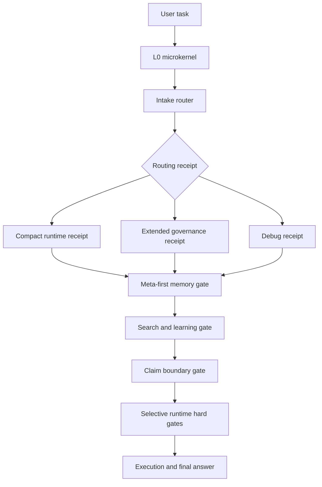

# Claim Boundary Harness

Stop coding agents from calling weak evidence "validated." Claim Boundary Harness adds meta-first routing, project-scoped memory lanes, R0-R5 risk receipts, and deployment adapters for claim verification.

Current version: `v0.15.0`

It is not tied to one agent runtime. It is a neutral starting point that can be mapped into any agent that can read workspace instructions, run local scripts, use command or skill folders, or call hooks before tools.

## At A Glance

Claim Boundary Harness is a small governance package for coding agents:

- routes tasks before work starts;
- keeps project, conversation, and static knowledge context isolated;
- forces retrieved context to carry source, provenance, belief state, and confidence;
- blocks or downgrades risky actions and strong claims when the adopting runtime calls the gates;
- keeps ordinary tasks cheap by using compact receipts and meta-first lookup.

Fast paths:

| Need | Start here |
| --- | --- |
| Understand the problem | [What Problem It Solves](#what-problem-it-solves) |
| See the architecture | [Architecture At A Glance](#architecture-at-a-glance) |
| Install or adapt | [Quick Start](#quick-start), [docs/adoption.md](docs/adoption.md) |
| Validate behavior | [docs/test-cases.md](docs/test-cases.md), [docs/reproduction.md](docs/reproduction.md) |
| Runtime troubleshooting | [docs/deployment-risk-patterns.md](docs/deployment-risk-patterns.md), [docs/integrations](docs/integrations) |

## Architecture At A Glance



## What Is Different

Most agent memory or harness projects cover one slice: prompt rules, memory
storage, hooks, retrieval, or test receipts. Claim Boundary Harness connects
those slices into one low-cost contract:

- **Claim boundary:** weak evidence stays `source_prior` or `bounded_claim`
  until local checks justify promotion.
- **Memory without bleed:** project, conversation, common-error, archive, and
  static-knowledge lanes can link to each other without silent payload mixing.
- **Metadata-bearing retrieval:** returned context must carry these fields:
  `source_tag` `derived_from` `belief_status` `confidence` `score_method`.
- **Selective hard gates:** R5 actions, risky tools, unresolved memory links,
  and strong final claims can be blocked when the runtime calls the gate.
- **Slow improvement:** repeated failures can become paired records or
  SkillOpt-style candidate edits without always-on self-rewriting.

Some mechanisms are adapted from public projects and established engineering
patterns. See [docs/influences-and-attribution.md](docs/influences-and-attribution.md)
and `CREDITS.toml`.

## Memory Lanes Without Memory Bleed

The memory design is not just "save more context." It is a lane-and-link system
that lets agents recover prior context without turning every memory into one
shared pool.

The core rule:

```text
separate memory lanes
-> meta-first lookup
-> explicit link edges between lanes
-> lane-scoped writes by default
-> metadata-bearing retrieval results
```

The framework separates project memory, conversation memory, common-error
records, self-reflection records, and optional global archive indexes. Those
lanes can point to each other through `memory_links.jsonl`, `references.jsonl`,
`supersession.jsonl`, `archive_index.jsonl`, stable `memory_id` values, and
`derived_from` provenance. The link tells the agent where related context
exists; it does not automatically copy the other lane's payload into the current
lane.

That gives three useful behaviors at the same time:

- **Project continuity:** a project can keep its own meta index, category
  indexes, capsules, errors, solutions, and open loops without being mixed with
  other projects.
- **Conversation continuity:** a long ordinary chat can get its own isolated
  conversation memory lane before it becomes a project. A later conversation can
  continue from it through a link-only edge.
- **Cross-lane discovery without silent contamination:** a lane may reference
  another lane, but cross-lane payload reads, writes, merges, or archive actions
  require explicit routing decisions and, when needed, user confirmation.

Continuation is link-only by default:

```text
old conversation memory meta
-> new conversation memory with its own memory_id
-> bounded summary_snapshot from the old meta/current-state summary
-> append continuation link old -> new
-> write new durable state only to the new lane
```

Explicit merges create a new merged memory and mark the old memories as sealed
or redirected. The old payloads remain auditable unless the user separately
requests deletion or redaction.

Retrieval also stays bounded. A memory result should not be returned as a plain
paragraph that "looks relevant." Required reusable-memory fields:
`source_tag` `derived_from` `belief_status` `confidence` `score_method`.
If a retrieval backend has no numeric score, it should use `score_method: none`
and omit `score`. This keeps source, provenance, belief state, and ranking
separate.

The result is an interlinked memory system that can find related project or
conversation context while still preventing default cross-project,
cross-conversation, or archive-to-active memory bleed.

## Reality Check

- Reference path: PowerShell scripts. Bash and Python adapters are starting points.
- Hard blocking works only on execution paths that actually call and honor the gates.
- Client updates can break instruction paths, hooks, runtimes, or skill loading; rerun smoke checks after updates.
- No memory backend is required. Add one only if it preserves lane isolation and provenance metadata.
- Public examples are synthetic; private project records are intentionally not included.

See [docs/adoption.md](docs/adoption.md) and
[docs/deployment-risk-patterns.md](docs/deployment-risk-patterns.md) for the
long-form deployment notes.

## What Problem It Solves

Modern coding agents often fail in the same places:

- They start working before deciding task risk.
- They load too much history, or the wrong project history.
- They mix memories from unrelated projects.
- They overstate partial runs as proven results.
- They skip current source checks for versioned or fast-changing facts.
- They repeat old mistakes because solved incidents are not stored in a reusable shape.
- Their instruction files, skills, and local checks are not connected into one clear path.

This project gives those pieces a simple shared structure.

```text
user request
-> root microkernel
-> intake router R0-R5
-> mandatory advisory control plane
-> lightweight routing receipt
-> event-triggered re-evaluation
-> only needed gates
-> project instructions and memory boundary
-> conversation memory lane when projectless long-chat signals require it
-> execution
-> final answer with evidence limits
-> optional paired error and solution records
```

## What It Implements

- **Root microkernel**: the small always-on rule set for language, evidence, risk, memory boundaries, and high-risk stops.
- **Intake router**: deterministic R0-R5 task classification.
- **Mandatory advisory control plane**: routing receipt, event-triggered dynamic review, and final boundary checks for skill/tool/plugin/search/memory/claim-gate decisions.
- **Receipt profile selector**: `compact_runtime` for low-cost single-agent operation, `extended_governance` for public/framework/project-boundary work, and `debug_receipt` for router diagnosis.
- **Router decision contract**: a stable low-cost receipt for target surface, audience, semantic ambiguity, module selection, memory route, external route, claim risk, and gates.
- **Declarative governance contract**: a compact adapter contract for stages, decision vocabulary, denial semantics, payload safety, and cost boundaries.
- **Version compatibility manifest**: a compact record of runtime/client version, hook schema, wrapper paths, tested denial behavior, bypass surfaces, and drift response.
- **Hook capture matrix**: a deployment-neutral stage map for prompt intake, pre-tool enforcement, post-tool observation, pre-compaction checkpointing, and final claim checks.
- **Lightweight CI smoke workflow**: a single GitHub Actions workflow for representative reproduction checks and WorkBuddy Python adapter tests, not a full compatibility matrix.
- **cbh-doctor diagnostics**: a read-only adoption preflight that checks package files, policy shape, PowerShell routing, selective hard-gate blocking, and Bash/jq availability.
- **Pytest contract checks**: parameterized tests for automatically verifiable `TC-xxx` routing and gate cases while keeping the Markdown contract readable for humans and agents.
- **Governance/routing update handling**: framework-rule, trigger-term, routing-rule, decision-matrix, and dynamic-evaluation edits are treated as R3 changes even when they are documentation-only.
- **Selective runtime enforcer scripts**: hook, wrapper, and tool-proxy entry points that return nonzero only at configured hard-stop boundaries when called by the adopting runtime. They are truly mandatory only when they are the sole execution path for the relevant agent action. The WorkBuddy Python adapter includes a hook runner for `UserPromptSubmit`, command-tool `PreToolUse`, and `Stop`/final checks.
- **Search and learning decision matrix**: routes public facts, GitHub repository evidence, general web cross-checks, external mechanism intake, and local validation boundaries.
- **Additive routing**: if a task matches more than one risk type, it keeps the highest risk label and returns the union of needed gates.
- **Memory isolation gate**: prevents accidental cross-project memory use unless the user clearly asks for it.
- **Conversation memory lane**: isolates durable state for long-running ordinary conversations that have no project lane yet.
- **Memory linking contract**: connects project, conversation, common-error, and archive memory lanes through explicit links, continuation records, merge records, and supersession edges without copying payloads by default.
- **Static knowledge layer**: optional wiki-style project manual pages for module maps, entry points, commands, conventions, and interfaces. Static notes are routed through an index and stay `source_prior` until locally checked.
- **Cost control contract**: keeps default execution cheap through receipt profiles, action-relevant fields, delta receipts, and active-context ceilings.
- **External research gate**: detects currentness signals such as latest, current, version, release, GitHub, and official sources.
- **Claim schema verifier**: blocks strong claims unless the claim has enough source and evidence boundary metadata.
- **Skill tree router**: routes semantic anchors, paired incident records, and project router manifests.
- **SkillOpt-style external module**: a default-off executable module for periodic candidate skill/router edits, validation-gate reports, rejected-edit records, and slow-update proposals while leaving runtime routing authority with the existing matrix. It is independently implemented and inspired by public SkillOpt mechanisms; it does not vendor upstream SkillOpt code.
- **Paired improvement records**: one error record plus one solution record for each solved recurring incident.
- **Layered project memory library**: a meta index points to category indexes, and category indexes point to individual capsules.
- **Memory meta index contract**: a multi-axis index shape for project memory libraries and skill point sets.
- **Source monitoring memory schema**: provenance, lifecycle, and belief-state fields for memory capsules, including `source_tag` `belief_status` `confidence` `derived_from`, observation state, lifecycle stage, belief traces, and optional adapter score boundaries.
- **Common error corpus template**: lightweight CE records for small recurring field/schema, tool-call, semantic-routing, patch-context, PowerShell/path, and Git-boundary mistakes, including the applied solution and validation, before they become full paired incidents.
- **Whiteboard templates**: empty project memory categories, project instructions, semantic anchors, and error/solution ledgers.

## Repository Layout

```text
.
+-- AGENTS.md
+-- CREDITS.toml
+-- CHANGELOG.md
+-- PROJECT_SKILL_MATRIX_REGISTRY.md
+-- VERSION
+-- .github/
|   +-- workflows/
|       +-- smoke.yml
+-- docs/
|   +-- adoption.md
|   +-- architecture.md
|   +-- examples.md
|   +-- influences-and-attribution.md
|   +-- skillopt-runtime.md
|   +-- static-knowledge-layer.md
|   +-- test-cases.md
|   +-- declarative-governance-contract.md
|   +-- version-compatibility-management.md
|   +-- integrations/
|   +-- memory-meta-index-contract.md
|   +-- source-monitoring-memory-schema.md
|   +-- memory-routing-contract.md
|   +-- common-error-corpus.md
|   +-- conversation-memory-lane.md
|   +-- memory-linking-contract.md
|   +-- format-layering.md
|   +-- cost-control-contract.md
|   +-- archive-and-persona-boundaries.md
|   +-- non-goals.md
|   +-- reproduction.md
|   +-- router-decision-contract.md
+-- integrations/
|   +-- workbuddy-python-runtime/
+-- tests/
|   +-- test_credits.py
|   +-- test_router_contract.py
+-- examples/
|   +-- sample-routing.md
|   +-- memory-capsule-examples.md
|   +-- memory-library-demo/
+-- skills/
|   +-- agent-error-memory/
|   +-- bug-solution-memory/
|   +-- embedded-harness/
|   |   +-- bash/
|   |   +-- validate_policy.ps1
|   |   +-- harness_runtime_enforcer.ps1
|   |   +-- harness_task_wrapper.ps1
|   |   +-- harness_tool_proxy.ps1
|   +-- shared-semantic-anchors/
|   +-- skillopt-training-layer/
|   +-- troubleshooting-skill-matrix/
+-- tools/
|   +-- cbh_doctor.py
|   +-- skillopt/
|       +-- skillopt_cycle.py
+-- templates/
    +-- adapter-contract/
    +-- common-error-corpus/
    +-- conversation-memory/
    +-- global-memory-archive/
    +-- skillopt/
    +-- static-knowledge-layer/
    +-- project/
```

## Where It Can Be Used

This framework can be adapted to agents that support one or more of these surfaces:

- workspace instruction files;
- project instruction files;
- command or skill folders;
- local script execution;
- tool-call hooks;
- project memory folders;
- wrapper scripts around the agent process.

If an agent only reads instruction files, this framework acts as a soft workflow contract. If an agent also supports hooks or wrappers, the gate scripts can become stronger runtime checks.

Integration examples are intentionally small and conservative:

- [docs/integrations/codex.md](docs/integrations/codex.md)
- [docs/integrations/claude-code.md](docs/integrations/claude-code.md)
- [docs/integrations/workbuddy.md](docs/integrations/workbuddy.md)
- [integrations/workbuddy-python-runtime/README.md](integrations/workbuddy-python-runtime/README.md)

## Why Skills Are Bounded

This framework treats skills as routed, reviewable capabilities rather than an unlimited self-growing pile. The default chain is:

```text
small root rules
-> task risk route
-> selected project lane
-> selected skill or knowledge pack
-> execution and claim boundary
-> optional paired improvement record
```

New skills should be created only when they remove real repeated work and have a clear scope, owner, retrieval surface, and non-applicable boundary. Routine facts, solved incidents, examples, and reference notes can live in memory capsules or knowledge packs without becoming new active skills.

## Core Rules Summary

The runtime rules live in `AGENTS.md` and the detailed contracts under `docs/`. The README keeps only the public summary:

- **Route first:** nontrivial work starts with a lightweight receipt that decides risk, active lane, memory mode, external-source need, claim risk, and required gates.
- **Expand only on triggers:** re-evaluate after new evidence, missing files, tool errors, scope changes, user corrections, current/version claims, GitHub/open-source intake, R5 actions, strong claims, or memory writes.
- **Search as a routed workflow:** current facts, external mechanisms, and repository claims use official/authority search, GitHub inspection, general cross-check, source-grounded intake, or local validation as separate paths.
- **Read memory meta-first:** start from `_META_INDEX`, a router manifest, or another meta layer; then open one category index; then open only the selected capsule or paired record.
- **Keep memory lane-scoped:** project, conversation, common-error, and archive memories should not write into each other unless the user explicitly asks for a cross-lane action.
- **Bound final claims:** do not turn source-prior notes, retrieved snippets, mocks, partial runs, or single smoke tests into `validated` claims.
- **Hard-stop only critical paths:** R5 actions, high-risk tools, low-confidence routes, long-term memory writes, and strong final claims can be blocked when the adopting runtime actually calls the hook, wrapper, or tool proxy.

Detailed contracts:

- [docs/router-decision-contract.md](docs/router-decision-contract.md)
- [docs/memory-routing-contract.md](docs/memory-routing-contract.md)
- [docs/memory-meta-index-contract.md](docs/memory-meta-index-contract.md)
- [docs/source-monitoring-memory-schema.md](docs/source-monitoring-memory-schema.md)
- [docs/deployment-risk-patterns.md](docs/deployment-risk-patterns.md)
- [docs/common-error-corpus.md](docs/common-error-corpus.md)

## Field Use Note

This framework has been used for an extended private Codex-based workflow. Once the root instruction file, harness policy, project registry, and skill tree are in place, that use suggests new conversations can continue to follow the same routing chain instead of rediscovering the workflow from scratch.

One observed side effect in that private Codex workflow is better reuse of prior process lessons: the agent sometimes recognized a repeated mistake pattern, looked up the relevant reusable fix, and corrected the path without waiting for a full manual restatement. Treat this as an operator observation, not proof of model fine-tuning or a universal behavior claim.

This is not yet broad field validation. The public package has not been battle-tested across many projects, many operators, or many agent runtimes.

The PowerShell, Bash, and WorkBuddy Python adapters are also not complete compatibility claims.
They were adapted from one local device environment. PowerShell and the WorkBuddy Python decision layer were smoke-tested locally; the Bash/mac-style scripts are reference adapters and still need target-shell verification on the adopter's machine.
The WorkBuddy Python adapter now includes a hook runner tested through local unit tests, including prompt routing, command-tool denial, Stop/final claim checks, and transcript extraction. One local WorkBuddy hook deployment has also been confirmed to run normally with this package. Real hard enforcement still depends on each adopter's WorkBuddy version honoring hook denial, exit code `2`, final-hook blocking, and the configured matcher scope.

The Claude Code integration page is currently a reference mapping, not a completed client-deployment validation. Adopters should confirm which instruction file the installed client reads, whether a pre-tool or command hook exists, whether blocked results are honored, and which surfaces can bypass the wrapper. If any of those checks fail, follow the deployment troubleshooting guide and let the adopting agent localize the problem before claiming hard enforcement.

Receipt profile behavior is covered by the current reproduction checks and WorkBuddy Python adapter tests. Bash and macOS/Linux reference paths still need target-shell verification on the adopter's machine.

It also supports independent project lanes. After global routing boundaries are configured, each project can keep its own instructions, memory roots, and incident records. That makes it possible to run separate local chains for separate projects without silent memory bleed, cross-project contamination, or unrelated progress records being mixed together.

## Concrete Examples

The package includes synthetic examples that show the intended record shapes without exposing any private project history:

- [examples/sample-routing.md](examples/sample-routing.md): routing examples for mixed risk and vague tasks.
- [examples/memory-capsule-examples.md](examples/memory-capsule-examples.md): project memory capsule, paired error/solution records, claim boundary record, and client-update drift record.
- [examples/memory-library-demo/_META_INDEX.md](examples/memory-library-demo/_META_INDEX.md): layered memory library demo using meta index, category indexes, capsule status, and supersession.
- [docs/router-decision-contract.md](docs/router-decision-contract.md): router and dynamic decision receipt contract.
- [docs/articles/claim-boundary-harness-design.md](docs/articles/claim-boundary-harness-design.md): design note covering claim boundaries, meta-first routing, memory lanes, runtime enforcement limits, deployment pitfalls, and reproduction scope.
- [docs/declarative-governance-contract.md](docs/declarative-governance-contract.md): small adapter governance contract for stages, denial semantics, payload safety, and cost boundaries.
- [docs/version-compatibility-management.md](docs/version-compatibility-management.md): runtime/client compatibility manifest and drift response rules.
- [docs/memory-routing-contract.md](docs/memory-routing-contract.md): memory mode, memory lane, record intent, and projectization drift contract.
- [docs/memory-meta-index-contract.md](docs/memory-meta-index-contract.md): multi-axis meta index contract for memory libraries.
- [docs/source-monitoring-memory-schema.md](docs/source-monitoring-memory-schema.md): source tags, belief-status state, structured confidence, derived provenance, observation state, and belief-trace rules for capsules.
- [docs/static-knowledge-layer.md](docs/static-knowledge-layer.md): optional wiki-style project manual layer with source-prior retrieval boundaries.
- [docs/common-error-corpus.md](docs/common-error-corpus.md): lightweight common-error sample format.
- [docs/skillopt-runtime.md](docs/skillopt-runtime.md): optional external SkillOpt-style candidate-edit runner and gate workflow.
- [docs/influences-and-attribution.md](docs/influences-and-attribution.md): public GitHub and engineering-pattern influences versus project contributions.
- [docs/test-cases.md](docs/test-cases.md): acceptance cases for adopters to run against their own runtime.
- [docs/conversation-memory-lane.md](docs/conversation-memory-lane.md): isolated memory lane for long-running projectless conversations.
- [docs/memory-linking-contract.md](docs/memory-linking-contract.md): stable memory IDs, timestamps, link-only continuation, explicit merge, and fuzzy lookup rules.
- [docs/format-layering.md](docs/format-layering.md): when to use Markdown, JSON, JSONL, CSV/TSV, SQLite, or generated Markdown.
- [docs/cost-control-contract.md](docs/cost-control-contract.md): routing field budgets, delta receipts, active-context ceilings, and action-relevant field rules.
- [docs/archive-and-persona-boundaries.md](docs/archive-and-persona-boundaries.md): optional cold archive, move/copy archive defaults, summary capsule exceptions, and conversation-only persona boundaries.
- [docs/deployment-risk-patterns.md](docs/deployment-risk-patterns.md): common deployment failures, concrete issue examples, and solution playbooks for WorkBuddy-like hooks, CLI agents, IDE agents, custom orchestrators, hosted agents, and wrapper-only setups.
- [docs/examples.md](docs/examples.md): expected gate behavior and how to interpret examples.

## Quick Start

1. Copy this package into a new workspace.
2. Open `AGENTS.md` and keep only the rules that match your workflow.
3. Edit `skills/embedded-harness/embedded_harness_policy.json`.
4. Replace `EXAMPLE_PROJECT` and `C:\\path\\to\\project` with your project lane and memory roots.
5. Optionally fill `templates/static-knowledge-layer/` with a project map,
   entry points, conventions, and interface notes.
6. Register the skill folders using whatever skill or command mechanism your agent supports.
6. Run the intake router before nontrivial work.

```powershell
powershell -ExecutionPolicy Bypass -File .\skills\embedded-harness\harness_intake_router.ps1 -TaskText "fix the script and run benchmark" -Cwd "C:\path\to\project"
```

Validate the policy after editing it:

```powershell
powershell -ExecutionPolicy Bypass -File .\skills\embedded-harness\validate_policy.ps1
```

The validator checks policy shape and, when run from the repository package,
also checks the memory invariant that `belief_trace_summary.current_status`
matches `belief_status`.

On Bash environments with `jq`:

```bash
bash ./skills/embedded-harness/bash/validate_policy.sh
bash ./skills/embedded-harness/bash/harness_intake_router.sh --task-text "fix the script and run benchmark" --cwd "/path/to/project"
```

Run the optional SkillOpt-style external module smoke test when Python is available:

```bash
python tools/skillopt/skillopt_cycle.py self-test
```

Run the read-only adoption diagnostic before trusting a new adapter or after a
client update:

```bash
python tools/cbh_doctor.py --repo-root . --json
```

Run the parameterized contract checks when `pytest` is available:

```bash
python -m pytest tests
```

After any agent client update, re-check the adapter surface before relying on the chain:

```text
1. Confirm the root instruction file is still loaded.
2. Confirm command, skill, hook, or wrapper paths still exist.
3. Run the intake router on a mixed-risk task.
4. Run the memory isolation gate on an allowed and a blocked path.
5. Run a claim verifier smoke check before publishing strong factual claims.
```

## Local Reproduction

The whiteboard package was smoke-tested locally with:

- intake routing for a mixed fix plus benchmark task;
- fallback classification for vague project work;
- memory isolation for an example project memory folder;
- blocked memory isolation for a sibling prefix path;
- trigger word-boundary and negation checks;
- external research trigger checks;
- external research negation checks;
- claim schema verification;
- policy validation;
- Bash smoke checks when `jq` is available;
- cbh-doctor adoption diagnostics;
- pytest contract checks for the automatically verifiable `TC-xxx` route cases and machine-readable credits;
- optional SkillOpt-style external module self-test;
- WorkBuddy Python adapter unit tests as a standalone decision layer, including prompt routing, command blocking, Stop/final claim blocking, surrogate-safe payloads, recording transcript extraction, and non-command file-content false-positive guards;
- package content scan for local project terms and sensitive field names.

See [docs/reproduction.md](docs/reproduction.md) for commands and expected results.

## Recommended First Customizations

- Rename `EXAMPLE_PROJECT` to your project lane.
- Replace placeholder memory roots.
- Copy `templates/conversation-memory/` only for long-running projectless conversations that need a checkpoint lane.
- Add one project instruction file under `templates/project/`.
- Keep the error and solution memory files empty until a real solved incident exists.
- Add only user-confirmed semantic anchors.
- Add wrapper or hook integration only after the basic scripts run in your environment.
- Review [docs/non-goals.md](docs/non-goals.md) before adding packaging, dashboards, broad comparison tables, or community-maintenance boilerplate.

## Limitations

This is a foundation package, not a complete safety system.

- The scripts are not a hard sandbox.
- A blocked result only works when the calling agent or wrapper honors it.
- A wrapper is truly mandatory only if it is the only command or tool execution path for the agent action it protects. If users or tools can bypass it, the framework remains advisory for that path.
- Most gates are intentionally advisory: they return structured decisions for the caller to honor. They become real interception only on execution paths where `harness_task_wrapper.ps1`, `harness_tool_proxy.ps1`, or an equivalent hook is the only way the agent can run the protected action.
- The trigger lists are intentionally small and should be tuned.
- The memory format is a template, not a database.
- Different agents need different adapter files and launch methods.
- The Claude Code guide is a reference mapping and has not yet been fully deployment-validated in an installed Claude Code client.
- The WorkBuddy Python adapter is experimental and is not a complete WorkBuddy compatibility guarantee.
- Bash/macOS/Linux support is a reference path until it is tested on the target machine and shell.
- There are likely missing cases, rough edges, and workflows we have not considered.

## Feedback Welcome

If you try this in another agent runtime, a different operating system, or a different project workflow, feedback is welcome. Useful feedback includes:

- unclear rules;
- missing risk categories;
- better trigger terms;
- better memory capsule shape;
- examples of hook integration;
- failure cases where the router chose the wrong path.

The goal is a simple reusable chain that helps agents stay scoped, honest, and easier to audit.
