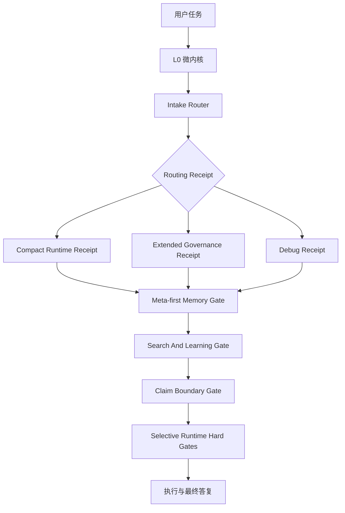

[English](./README.md) | 中文

# Claim Boundary Harness

[](https://github.com/qimen039-code/claim-boundary-harness/actions/workflows/smoke.yml)

Claim Boundary Harness（CBH）是一套面向 agent 工作流的外部认知治理
harness。它把声明验证、记忆连续性、风险路由、纠错沉淀和客户端适配契约
组合成结构性约束，而不是再写一段普通提示词。

当前版本：`v0.18.1`

CBH 的目标不是替换大模型、训练新模型，或把所有任务都塞进沉重的记忆后端。
它的设计杠杆很小：先路由，再只打开必要的记忆、证据窗口或工具边界；保留
来源、证据和项目 lane；在宿主运行时支持时，才把高风险动作和强事实声明变成
可拦截的执行边界。

CBH 不是：

- 向量数据库或语义记忆数据库；
- 模型训练方案；
- 通用安全沙箱；
- 只有提示词的工作流建议；
- 保证所有客户端都能硬拦截工具的兼容层。

公开仓库提供的是框架和参考实现。实际强度取决于宿主客户端、hook 或 wrapper
能力、本机项目 lane 配置，以及采用者自己跑过的验证。

## 快速理解

CBH 给编码 agent 增加一个低成本外部认知层：

- 工作开始前先判断任务风险、项目 lane、记忆需求、外部证据需求和声明风险；
- 项目记忆、长对话记忆、common-error 语料、静态知识和归档默认隔离；
- 检索结果必须带 `source_tag`、`derived_from`、`belief_status`、`confidence`、
  `score_method`；
- 记忆写入必须保留原语言内容和足够主谓宾上下文，避免写成孤立短句；
- 强事实声明不能把 source prior、单次 smoke、mock、局部运行写成 validated；
- R5 动作、危险工具、强声明、跨 lane 写入等边界，在宿主实际调用 gate 时可以
  被阻断；
- 普通任务保持便宜，只使用 compact receipt 和 meta-first 查找。

常用入口：

| 需求 | 入口 |
| --- | --- |
| 理解框架 | [解决的问题](#解决的问题) |
| 看整体结构 | [架构概览](#架构概览) |
| 安装或迁移 | [快速开始](#快速开始)、[docs/adoption.md](docs/adoption.md) |
| 验证行为 | [docs/test-cases.md](docs/test-cases.md)、[docs/reproduction.md](docs/reproduction.md) |
| 客户端适配 | [docs/integrations](docs/integrations) |

## 能力索引

本文件偏快速理解和迁移操作；完整目录、示例和复现命令见英文 README 与下方关键文档。

| 能力 | 主要入口 | 当前公开状态 |
| --- | --- | --- |
| 路由与声明 gate | `harness_intake_router.ps1`、`harness_claim_schema_verifier.ps1` | 脚本契约和测试覆盖 |
| runtime 硬阻断 | `harness_runtime_enforcer.ps1`、`harness_tool_proxy.ps1`、`harness_task_wrapper.ps1` | 只有宿主调用时才硬阻断 |
| 策略与适配预检 | `compile_policy_from_toml.py`、`validate_policy.ps1`、`tools/cbh_doctor.py` | 漂移和预检工具 |
| WorkBuddy adapter | `integrations/workbuddy-python-runtime/` | 单元测试覆盖；一次本地 hook 部署观察 |
| 记忆 lane 与账本 | `templates/project/memory-library/`、`templates/conversation-memory/`、`codex_session_ledger.py` | 模板和证据索引 |
| 检索与读取 | `docs/hybrid-memory-retrieval-contract.md`、`docs/content-reading-contract.md` | meta-first、保留来源、有界窗口 |
| skill 生命周期 | `docs/skill-lifecycle-contract.md`、`templates/skill-lifecycle/` | active-frame 与 release receipt |
| 反馈与因果复核 | `docs/memory-feedback-loop-trial.md`、`docs/router-decision-contract.md` | CE 复用与过度归因边界 |

## 架构概览



CBH 的核心链路：

```text
用户任务
-> L0 微内核
-> R0-R5 路由
-> 必要的记忆、外部证据、读取或声明 gate
-> 项目/对话/错误语料 lane 隔离
-> 执行
-> 最终声明边界复核
```

## 解决的问题

现代编码 agent 经常在这些地方出错：

- 没有先判断任务风险就开始改文件或运行命令；
- 读取了太多历史，或者读取了错误项目的历史；
- 把不同项目、不同对话、不同错误语料混在一起；
- 把单次 smoke、mock、partial run 写成验证成功；
- 遇到自身内部知识库或已有上下文无法高效解决的困难、绕弯路过多时，仍不主动外部检索或查证；
- 重复犯同类小错误，因为错误和解决方式没有沉淀成可复用记录；
- skill、memory、hook、AGENTS.md 等执行入口和治理文件没有互相链接成一整条闭环。

CBH 用一套低成本结构把这些点连起来。

## 核心差异

- **声明边界**：弱证据只能是 `source_prior` 或 `bounded_claim`，不能直接升成
  `validated`。
- **记忆不串 lane**：项目、对话、common error、自反省、归档和静态知识可以互相
  链接，但默认不混入 payload。
- **原始会话账本**：raw session JSONL 可先转成 session、turn、segment、time-anchor、
  evidence-ref，再进入项目或长对话记忆。
- **带元数据的检索**：返回的上下文必须保留来源、派生关系、信念状态、置信依据和
  分数方法。
- **原语言记忆写入**：中文内容保持中文，英文代码/API 保持英文；结构字段使用英文，
  以降低适配器和编码风险。
- **混合检索是增强，不是替换**：先 meta-first 缩小 lane/category，再用原文关键词、
  中文字粒度、英文术语或可选 lexical ranking 增强召回。
- **读取和检索分开**：检索命中不等于已读证据。强声明需要按读取 profile 打开原文窗口，
  并记录未读区或验证债。
- **skill 生命周期**：未选中的 skill 只保留名称和元摘要；执行阶段才加载正文；阶段结束
  写 `skill_release_receipt`，避免长任务依赖压缩后的旧正文。
- **清理不等于清零债务**：出现记忆污染、目标污染、脏树债或技术债堆积时，
  先清查分组，只清当前必须清理项，并把可暂存项标为 `candidate_technical_debt`。
- **纠错沉淀**：小而可复用的问题进入 `CE-*` common-error 记录；严重、重复或高影响问题
  才升级成 `ERR-*` / `SOL-*`。
- **两类拟态闭环分离**：记忆反馈闭环负责经验复用；因果归因 gate 防止把局部观察写成
  机制证明。

## 记忆 lane 和链接

CBH 的记忆不是“越多越好”，而是 lane-and-link：

```text
独立记忆 lane
-> meta-first 查找
-> 显式 link edge
-> 默认 lane 内写入
-> 返回带 source/provenance/belief 元数据的结果
```

项目记忆、长对话记忆、common-error 语料、自反省记录、静态知识和归档索引可以互相指向，
但不默认复制内容。跨 lane payload 读取、写入、合并、归档或删除都必须有明确路由决策，
必要时需要用户确认。

长对话接续默认是 link-only：

```text
旧对话 memory meta
-> 新对话 memory_id
-> 有边界的 summary_snapshot
-> 写 old -> new continuation link
-> 新状态只写入新 lane
```

## 记忆反馈闭环

`feedback_loop` 是轻量试点字段，用在可复用记忆、CE、ERR/SOL 或决策记录中：

```text
memory
-> prediction
-> verification
-> calibration
```

它不是让用户每次要求模型“主动预测”。正确用法是：当路由选中了带有
`feedback_loop` 或预防复发作用的记录，agent 应当内部检查这条记忆预期当前任务如何处理、
当前是否符合、若失败如何校准。用户可以纠正或点名运行这套闭环，但它不是唯一触发入口。

注意：读取 common-error 记录不等于写新长期记忆。只有显式记录/写入意图，或 post-tool
阶段已修复并验证的小问题，才可写入 durable CE。
`feedback_loop_profile` 将路径分为 `index_hint`、`record_candidate`、
`prevention_review` 和 `explicit_cycle`，避免普通查询反复加载完整闭环。

## 因果归因边界

CBH 不把“路径、观察、案例”直接写成机制定义。关于趋势、长期行为、全局能力、幻觉漂移、
模型是否变好等问题，必须区分：

- `mechanism_property`：机制结构本身的属性；
- `empirical_record`：本地观察、形成路径、案例样本；
- `causal_hypothesis`：尚未对照验证的因果假设；
- `validated_causality`：有控制、复现或明确验证链的因果结论。

公开/私有边界是另一类问题，不放进因果归因 gate。

## 快速开始

1. 把这个包复制到目标 workspace。
2. 打开 `AGENTS.md`，保留与你工作流匹配的规则。
3. 修改 `skills/embedded-harness/embedded_harness_policy.authoring.toml` 中的高频触发规则。
4. 运行编译检查，保持 runtime JSON 同步。
5. 本机私有项目 lane 不要写进公开 JSON。复制
   `skills/embedded-harness/embedded_harness_policy.local.example.json` 为
   `embedded_harness_policy.local.json`，或设置 `CBH_PROJECT_LANES_FILE` 指向私有 overlay。
6. 可选：填充 `templates/static-knowledge-layer/` 作为项目地图、入口点和约定手册。
7. 在非平凡任务前运行 intake router。

PowerShell：

```powershell
python .\skills\embedded-harness\compile_policy_from_toml.py --check
powershell -ExecutionPolicy Bypass -File .\skills\embedded-harness\validate_policy.ps1
powershell -ExecutionPolicy Bypass -File .\skills\embedded-harness\harness_intake_router.ps1 -TaskText "fix the script and run benchmark" -Cwd "C:\path\to\project"
```

Bash 环境：

```bash
bash ./skills/embedded-harness/bash/validate_policy.sh
bash ./skills/embedded-harness/bash/harness_intake_router.sh --task-text "fix the script and run benchmark" --cwd "/path/to/project"
```

测试：

```bash
python tools/cbh_doctor.py --repo-root . --json
python -m pytest tests
python -m unittest discover -s integrations/workbuddy-python-runtime/tests
```

## 已测试客户端边界

当前公开包只声明以下边界：

- **Codex**：Windows 本地扩展使用和本机 active harness smoke checks。
- **WorkBuddy**：Python adapter 单元测试和一次本地 hook 部署路径确认；不是完整 WorkBuddy
  版本认证。
- **豆包**：一次本地客户端适配和部署测试，包含脚本链、JSON memory 布局、UTF-8 输出要求，
  以及宿主 `interaction.warn` 对一个破坏性删除路径的硬确认测试。
- **其他客户端**：只有参考映射，直到目标客户端的 instruction、hook、wrapper、denial、
  bypass surfaces 被实际测试。

## 关键文档

- [docs/router-decision-contract.md](docs/router-decision-contract.md)
- [docs/memory-routing-contract.md](docs/memory-routing-contract.md)
- [docs/memory-meta-index-contract.md](docs/memory-meta-index-contract.md)
- [docs/source-monitoring-memory-schema.md](docs/source-monitoring-memory-schema.md)
- [docs/memory-feedback-loop-trial.md](docs/memory-feedback-loop-trial.md)
- [docs/memory-write-granularity-contract.md](docs/memory-write-granularity-contract.md)
- [docs/hybrid-memory-retrieval-contract.md](docs/hybrid-memory-retrieval-contract.md)
- [docs/content-reading-contract.md](docs/content-reading-contract.md)
- [docs/skill-lifecycle-contract.md](docs/skill-lifecycle-contract.md)
- [docs/correction-and-reflection-guide.md](docs/correction-and-reflection-guide.md)
- [docs/common-error-corpus.md](docs/common-error-corpus.md)
- [docs/common-issues-and-solutions.md](docs/common-issues-and-solutions.md)
- [docs/deployment-risk-patterns.md](docs/deployment-risk-patterns.md)
- [docs/integrations/codex.md](docs/integrations/codex.md)
- [docs/integrations/workbuddy.md](docs/integrations/workbuddy.md)
- [docs/integrations/doubao.md](docs/integrations/doubao.md)

## 限制

- 脚本不是沙箱。
- 只有宿主实际调用并尊重 gate，阻断才有效。
- 触发词仍需按真实项目持续校准。
- 记忆格式是模板和契约，不是数据库。
- 本机私有路径应放在 local overlay，不应提交到公开仓库。
- Bash/macOS/Linux 参考路径需要在目标机器和 shell 中验证。
- 还有未知边界和未覆盖工作流。

## 反馈

如果你把 CBH 迁移到其他 agent、系统或项目，最有价值的反馈包括：

- 路由误判；
- 记忆 lane 污染风险；
- hook 或 wrapper 不生效的路径；
- 强声明边界不够准确的例子；
- 更好的 CE/ERR/SOL 记录形态；
- 客户端更新后失效的适配路径。

目标不是让 agent 变重，而是用最小的外部结构，让它更稳、更诚实、更容易审计。
