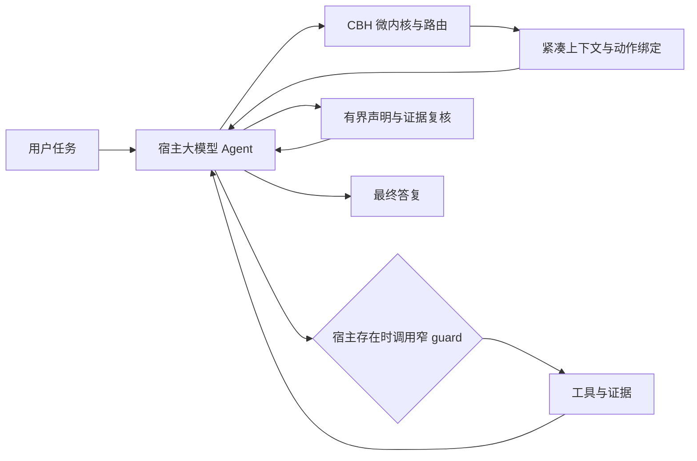

[English](./README.md) | 中文

# Claim Boundary Harness

[](https://github.com/qimen039-code/claim-boundary-harness/actions/workflows/smoke.yml)
[](https://doi.org/10.5281/zenodo.21189879)

## 30 秒看懂

CBH 是面向编码 Agent 大模型的一套控制闭环。它把任务总目标、相关上下文、执行证据和
下一步动作持续连接起来，覆盖规划、工具调用、错误恢复与最终声明。它不替 AI 工作，
也不是另一个 AI、后台任务引擎或大模型替代品。

在复杂和长期任务中，CBH 帮助 AI 少忘事、不串项目、不提前宣布完成、不反复犯同一种
错误，也不轻易把猜测写成已经确认的事实。

真正负责理解需求、制定计划、使用工具、修复错误和回答用户的，始终是原来的大模型。
CBH 做的是把目标、相关记忆、可用工具、执行记录和验证依据整理好，在关键时刻交给
模型使用。它能减少可避免的问题，但不能保证模型永远正确，也不能彻底消除幻觉。
只有客户端真正加载并验证了相关入口，对应能力才算已经生效。

对于受保护的高风险动作，CBH 的第一道阻断发生在工具调用之前：模型决策路径必须先
停止，向人工汇报精确目标、范围、影响、可逆性和非目标，在取得针对该事件的明确授权
之前不得形成或调用实际执行动作。这是模型层的强制执行前 gate；它不同于宿主 hook、
代理、权限系统或沙箱提供的执行时硬拦截，后者只有在真实接入并验证的路径上才成立。

## 它解决什么问题

| 常见问题 | CBH 怎么帮忙 | 深入了解时的名称 |
| --- | --- | --- |
| 长任务做着做着偏离目标，或只完成一小部分就以为全部完成 | 持续保留总目标、当前范围和最终检查 | 任务路由、事件复评、最终声明检查 |
| 一个局部可见修改还没落地，Agent 就先搭保护层、框架、策略或全局抽象 | 最小必要读取后，第一次实质修改必须落到用户指定表面；扩大范围必须有证据或明确要求 | `direct_outcome_first_gate`、动作绑定、有界扩张条件 |
| 新开对话或上下文快满时，重要细节丢失 | 保留简短导航，并能继续追到原始对话、日志和证据 | 对话账本、保留来源的记忆 |
| 一个项目的历史混进另一个项目 | 默认分开保存和查找不同项目、对话、错误与归档内容 | 记忆分区（memory lane）、先看索引再下钻 |
| 同一种执行错误反复出现 | 把已经验证的问题和解法配对保存，在相似动作前重新检查 | CE/ERR/SOL 记录、行为纠偏 |
| 把猜测、局部测试或模拟结果说成已经证明 | 要求结论强度与文件、测试、日志或外部来源相匹配 | 声明边界、证据边界 |
| 历史、工具和 Skill 太多，挤占模型上下文 | 只取当前任务真正需要的内容，需要时再调用能力 | 上下文选择、Skill 生命周期 |
| 客户端或工具更新后，原来的接入方式失效 | 提供重新检查真实入口的方法，只把仍通过验证的部分算作可用 | 兼容性检查、生命周期检查 |

## 先选择使用方式

不是每一位编码 Agent 用户都必须安装 CBH。按照自己真正遇到的问题，选择成本最低且
足够有效的使用方式即可；以下是使用方式，不是必须逐级升级的成熟度等级。

| 使用方式 | 适用情况 | 建议行动 | 是否算已经部署 |
| --- | --- | --- | --- |
| 阅读与参考 | 只想了解如何整理记忆、交接长任务、检查证据或减少重复错误 | 阅读相关说明；复用时注明来源 | 否 |
| 借用一个设计思路 | 只需要其中一个办法，例如把不同项目的记忆分开 | 在自己的方案中改写并测试这个办法，同时保留适用的署名和许可证说明 | 否；这是参考 CBH 后的独立实现 |
| 完整安装到自己的 Agent | 上述问题已经反复影响日常使用，希望各部分协同工作 | 把整套必要组件部署到实际客户端，按客户端能力适配并完成验收 | 只有真实客户端检查通过后才算 |
| 集成进 Agent 客户端或团队工具 | 正在开发 Agent 产品、客户端或团队内部工具 | 把 CBH 的规则、记忆、检查和交接链路接入产品并持续测试 | 只有实际接入且验证通过的部分算生效 |

只阅读或借鉴 CBH 也是合理的使用结果，不需要因为其中一个办法适合自己就安装整套
框架。只有选择完整安装或产品集成，并声称相关能力已经生效时，才需要部署完整的必要
组件、接入真实客户端并完成验收。

## 快速开始

如果选择了完整本地部署或宿主集成，开始前不需要先读懂 CBH 的全部契约。只要你的
类 Codex IDE 或终端 Agent 能读取工作区指令并运行本地工具，就可以在目标 Agent 中
新建任务、给它一个可访问的本地工作区，然后把下面这一整行直接发给它：

```text
请将 https://github.com/qimen039-code/claim-boundary-harness 默认 main 分支的最新 Claim Boundary Harness 部署到当前编码 Agent 环境：先阅读 docs/agent-deployment-map.md；检查当前宿主真实存在的指令、Skill、Command、Hook、模型循环、权限与沙箱接口；列出精确写入目标并备份现有配置；选择一个完整的声明式部署 profile，生成并保留其全部依赖闭包；取得必要授权后，只对宿主确实支持的表面进行本地适配；使用公开模板初始化私有本地 overlay，不得公开本机路径或记忆；运行编译器、验证器、doctor、相关 profile 测试和一次新任务生命周期 smoke；最后返回包含 checked_available、checked_missing、checked_blocked 的部署回执，且不得把“文件已复制”说成“能力已激活”。
```

这是一条发给编码 Agent 的部署指令，不是假装适用于所有系统的通用 shell 安装命令。
不同客户端的指令文件、Skill 注册、Hook、权限系统和工具生命周期并不相同，因此必须
先检查真实宿主，再进行适配。本地 Codex 类宿主可以将 `codex-local-minimal` 作为第一
个完整基线；其他宿主可以把它当作集成参考，但不能把它当作兼容性证明。

### Agent 接下来应该做什么

1. 先读部署地图并检查实际安装的客户端，再开始写入。
2. 列出准备修改的文件或设置，保留并备份采用者已有的本地配置。
3. 完整生成一个声明式 runtime profile，不按能力名称零散挑选文件。
4. 将这套完整基线映射到宿主真实存在的接口，不伪造不存在的 Hook 或 Skill 能力。
5. 运行仓库检查和一次新任务生命周期检查，再报告哪些能力已激活、缺失或被阻塞。

### 使用前需要注意

- CBH 是宿主 Agent 的能力增强层，不是另一个脱离模型运行的自治软件。
- 下载或复制仓库不等于激活；宿主必须真正加载指令入口，并调用所声明的 router、
  consumer 或 hook。
- 现有指令和配置必须通过经过复核的局部补丁或备份保留，不能盲目覆盖用户环境。
- 私有项目路径、凭据、记忆记录和本地事故只能留在 local overlay，不能写入公开仓库
  或公开 runtime policy。
- 宿主不支持的能力应标记为 `checked_missing` 或 `checked_blocked`，不能静默宣称启用。
- 客户端、Hook 协议或相关配置更新后，需要重新运行本地兼容性检查。

当前 main 分支版本：`v1.2.4`。
最新已打 tag 的 GitHub Release：[`v1.2.4`](https://github.com/qimen039-code/claim-boundary-harness/releases/tag/v1.2.4)。
外部查询当前版本时，应同时核对默认分支 `VERSION` 与 GitHub
[`releases/latest`](https://github.com/qimen039-code/claim-boundary-harness/releases/latest)，
二者必须指向同一版本。
更早的 tag 仅为历史快照，不是当前 main 分支安装、能力或兼容性依据。

> **现行版本检索注释：** 框架当前状态以默认 `main` 分支的最新提交为准，
> 可下载的发布版本以最新非草稿 GitHub Release 为准。历史提交、旧 tag、
> 缓存摘要和归档文档不能单独作为当前版本证据，除非当前 `main` 或最新
> Release 明确指向它们。

> **部署完整性注释：** CBH 被设计为一个相互依赖的控制闭环。部署时应先选择
> 一个完整的声明式 runtime profile，部署其全部依赖闭包并验证通过，然后再做
> 宿主适配。初次部署不要按感觉拆选路由、记忆、检索、纠偏或验证组件；局部部署
> 可能切断组件间的相互增益链路，使实际能力低于这些局部组件看起来应有的能力。
> 论文、说明文档、示例和开发测试不属于运行时能力组件，可以不进入 runtime 包。

引用与署名：如果你在研究、工具、产品或评测中使用、改编或讨论 CBH，请优先使用
`CITATION.cff` 引用本仓库，并保留 `NOTICE.md` 与 MIT license notice。
Zenodo concept DOI 为 [10.5281/zenodo.21189879](https://doi.org/10.5281/zenodo.21189879)。

宿主大模型始终是任务规划者、工具使用者、语义判断者和最终答复作者。CBH
不会脱离大模型自行执行用户任务。它的确定性辅助能力保持很窄：生成紧凑路由、
选择索引化上下文或验证已声明的边界，然后把结果交还给模型 Agent。可选的宿主
纠偏 hook 只能改写一个经过机械验证的当前输入；它不会授权、拒绝、冻结任务，
也不替代宿主原生安全边界。

它也不是一次写死的提示词包。真实使用中暴露出来的路由误判、适配漂移、记忆污染、
重复小错误和技术债，应该被沉淀成有边界的记录、测试或小型策略更新，而不是不断堆
active skill、长提示词和压缩摘要，最后把上下文污染到让模型变钝。

CBH 不是：

- 脱离大模型独立运行的自治任务引擎或后台工作流；
- 向量数据库或语义记忆数据库；
- 模型训练方案；
- 通用安全沙箱；
- 只有提示词的工作流建议；
- 保证所有客户端都能硬拦截工具的兼容层。

公开仓库提供的是框架和参考实现。实际强度取决于宿主客户端、hook 或 wrapper
能力、本机项目 lane 配置，以及采用者自己跑过的验证。

### 执行前停止与人工授权

过去把 CBH 笼统写成“advisory、没有硬拦截”并不准确。需要区分两层：

- **模型层执行前停止：** 一旦识别出受保护的高风险动作，受 CBH 治理的 Agent 在取得
  精确人工授权前不得进入工具执行。这一状态转换规则不依赖宿主是否提供 deny hook。
- **宿主执行时硬拦截：** Hook、代理、权限系统、沙箱或操作系统在模型之外拒绝工具
  调用。CBH 只对已经真实接入并通过阻断测试的路径声明这种能力。

人工授权只绑定一个具体事件、一个声明范围和一次使用；该次操作消费授权，后续不同或
实质变化的危险动作必须重新停止并请求授权。人工在看到风险后授权精确操作，表示人工
接管该次风险决定；CBH 记录授权边界，但不把该操作认证为安全，也不对该次已授权危险
操作的后果作安全担保。Agent 仍必须严格限制在授权范围内，并回报实际结果。

## 技术概览（面向开发者和 Agent）

CBH 为 Codex 类宿主大模型 Agent 增加一层低成本、面向模型的能力增强与认知治理；
模型仍负责规划、工具调用、恢复和最终答复。这个仓库已经包含：

- 工作开始前的 routing receipt、R0-R5 风险处理和事件触发复评；
- 项目、长对话、common-error、归档和静态知识的 lane 边界；
- source-preserving 记忆胶囊、meta-first 检索、对话账本和 link-only 接续记录；
- claim、因果归因、外部检索、读取、反馈闭环、债务清理和 skill 生命周期契约；
- 针对当前动作候选的任务内行为纠偏，并在原生 hook 看不到调用时提供 typed nested-tool preflight；只有精确匹配且机械验证通过时才改写，否则静默 no-op；
- 可自动检查的测试、smoke、示例、引用来源和复现记录。

这个 README 是给人和“快速扫 README 的 agent”看的公开概览。真正影响 agent 执行的
内容在 `AGENTS.md`、embedded policy、gate 脚本、adapter contract、templates 和
`docs/` 下的细分契约里。

常用入口：

| 需求 | 入口 |
| --- | --- |
| 判断是否需要部署 | [先选择使用方式](#先选择使用方式) |
| 理解框架 | [30 秒看懂](#30-秒看懂)、[它解决什么问题](#它解决什么问题) |
| 看整体结构 | [架构概览](#架构概览) |
| 安装或迁移 | [快速开始](#快速开始)、[手动部署与验证](#手动部署与验证)、[Agent 自部署地图](docs/agent-deployment-map.md)、[docs/adoption.md](docs/adoption.md) |
| 验证行为 | [docs/test-cases.md](docs/test-cases.md)、[docs/reproduction.md](docs/reproduction.md) |
| 客户端适配 | [docs/integrations](docs/integrations) |

## CBH 能力索引

本文件提供中文快速理解、核心能力和迁移入口；英文 README 保留完整目录树和更长的
复现清单。引用来源、测试边界和细分契约见下方关键文档。

| 能力 | 主要入口 | 当前公开状态 |
| --- | --- | --- |
| 路由与声明 gate | `harness_intake_router.ps1`、`harness_claim_schema_verifier.ps1` | 脚本契约和测试覆盖 |
| 行为纠偏 | `behavior_correction_gate.py`、`behavior_correction_hook.py` | 验证后的当前输入改写或静默 no-op；不产生执行权限 |
| 嵌套工具复核 | `nested_tool_preflight.py`、`compact_failure_audit.py` | typed advisory preflight 与有界失败证据；不是宿主 hook |
| 删除风险提示 | `dangerous_delete_guard.py` | 按需风险分类，不产生授权或宿主阻断 |
| 策略与适配预检 | `compile_policy_from_toml.py`、`validate_policy.ps1`、`tools/cbh_doctor.py` | 漂移和预检工具 |
| 记忆 lane 与账本 | `templates/project/memory-library/`、`templates/conversation-memory/`、`codex_session_ledger.py` | 模板和证据索引 |
| 模型上下文选择 | `harness_action_consumer.py`、router 的 `memory_source_hints` | 把精确索引命中转成保留来源的紧凑 Agent 上下文 |
| 通用外部检索规划 | `external_retrieval_strategy.py`、`harness_external_research_gate.ps1` | 保留精确锚点、按原生来源与目标分别规划；实际检索仍由模型 Agent 执行 |
| 检索与读取 | `docs/hybrid-memory-retrieval-contract.md`、`docs/content-reading-contract.md` | meta-first、保留来源、有界窗口 |
| skill 生命周期 | `docs/skill-lifecycle-contract.md`、`templates/skill-lifecycle/` | active-frame 与 release receipt |
| 反馈与因果复核 | `docs/memory-feedback-loop-trial.md`、`docs/router-decision-contract.md` | CE 复用与过度归因边界 |
| 科研路线分诊 | `docs/research-triage-three-questions.md` | 区分机械裁判、裁判审计和治理路径 |
| 交互错误路由 | `docs/interaction-error-corpus.md` | 单语料库、四条隔离控制表面车道 |

WorkBuddy、豆包、Bash 和其他宿主或平台适配属于独立的 integration reference，
不是 CBH 能力项；是否可用取决于采用者的宿主接口和本地验证。

## 架构概览


```mermaid
flowchart LR
    U[用户任务] --> A[宿主大模型 Agent]
    A --> R[CBH 微内核与路由]
    R --> C[紧凑上下文与动作绑定]
    C --> A
    A --> H{宿主存在时调用窄 guard}
    H --> T[工具与证据]
    T --> A
    A --> V[有界声明与证据复核]
    V --> A
    A --> F[最终答复]
```

CBH 的核心链路：

```text
用户任务
-> L0 微内核
-> R0-R5 路由
-> 必要的记忆、外部证据、读取或声明 gate
-> 项目/对话/错误语料 lane 隔离
-> 执行
-> 最终声明边界复核
```

## 技术问题与对应机制

现代编码 agent 经常在这些地方出错：

- 没有先判断任务风险就开始改文件或运行命令；
- 读取了太多历史，或者读取了错误项目的历史；
- 把不同项目、不同对话、不同错误语料混在一起；
- 把单次 smoke、mock、partial run 写成验证成功；
- 遇到自身内部知识库或已有上下文无法高效解决的困难、绕弯路过多时，仍不主动外部检索或查证；
- 重复犯同类小错误，因为错误和解决方式没有沉淀成可复用记录；
- skill、memory、hook、AGENTS.md 等执行入口和治理文件没有互相链接成一整条闭环。

CBH 用一套低成本结构把这些点连起来。

## 核心差异

- **声明边界**：弱证据只能是 `source_prior` 或 `bounded_claim`，不能直接升成
  `validated`。
- **记忆不串 lane**：项目、对话、common error、自反省、归档和静态知识可以互相
  链接，但默认不混入 payload。
- **原始会话账本**：raw session JSONL 可先转成 session、turn、segment、time-anchor、
  evidence-ref，再进入项目或长对话记忆。
- **带元数据的检索**：返回的上下文必须保留来源、派生关系、信念状态、置信依据和
  分数方法。
- **原语言记忆写入**：中文内容保持中文，英文代码/API 保持英文；结构字段使用英文，
  以降低适配器和编码风险。
- **混合检索是增强，不是替换**：先 meta-first 缩小 lane/category，再用原文关键词、
  中文字粒度、英文术语或可选 lexical ranking 增强召回。
- **读取和检索分开**：检索命中不等于已读证据。强声明需要按读取 profile 打开原文窗口，
  并记录未读区或验证债。
- **skill 生命周期**：未选中的 skill 只保留名称和元摘要；执行阶段才加载正文；阶段结束
  写 `skill_release_receipt`，避免长任务依赖压缩后的旧正文。
- **持续改进不是堆叠 skill**：重复错误可以进入 `CE-*`、`ERR-*` / `SOL-*`、反馈闭环
  校准或候选 skill 修改，但每条路径都要保留范围、验证和拒绝边界。目标是让
  agent 越用越熟练，而不是让上下文越堆越重。
- **抑制幻觉漂移，不声称消灭幻觉**：带来源的记忆、有界原文窗口、外部证据路由、
  因果归因复核和最终声明边界，目标是降低错误声明跨轮次、跨对话累积放大的概率；
  这不是“模型不会幻觉”的证明。
- **局部因果先看任务全貌**：局部修复、根因判断或窄文件修改，先读最近的目标、lane、
  状态表、文件图或工作流状态，不能把局部症状直接写成根因。
- **局部结果先于保护性扩张**：对有界 UI/UX 或其他用户可见修改，完成最小必要读取后，
  第一次实质修改必须直接触及用户指定表面。只有直接实现已有可复核失败证据、验收客观上
  跨多个表面、安全或数据完整性阻断直接路径，或用户明确要求系统化/复用范围时，才扩张。
- **清理不等于清零债务**：出现记忆污染、目标污染、脏树债或技术债堆积时，
  先清查分组，只清当前必须清理项，并把可暂存项标为 `candidate_technical_debt`。
- **纠错沉淀**：小而可复用的问题进入 `CE-*` common-error 记录；严重、重复或高影响问题
  才升级成 `ERR-*` / `SOL-*`。
- **两类拟态闭环分离**：记忆反馈闭环负责经验复用；因果归因 gate 防止把局部观察写成
  机制证明。

## 记忆 lane 和链接

CBH 的记忆不是“越多越好”，而是 lane-and-link：

```text
独立记忆 lane
-> meta-first 查找
-> 显式 link edge
-> 默认 lane 内写入
-> 返回带 source/provenance/belief 元数据的结果
```

项目记忆、长对话记忆、common-error 语料、自反省记录、静态知识和归档索引可以互相指向，
但不默认复制内容。跨 lane payload 读取、写入、合并、归档或删除都必须有明确路由决策，
必要时需要用户确认。

长对话接续默认是 link-only：

```text
旧对话 memory meta
-> 新对话 memory_id
-> 有边界的 summary_snapshot
-> 写 old -> new continuation link
-> 新状态只写入新 lane
```

## 记忆反馈闭环

`feedback_loop` 是轻量试点字段，用在可复用记忆、CE、ERR/SOL 或决策记录中：

```text
memory
-> prediction
-> verification
-> calibration
```

它不是让用户每次要求模型“主动预测”。正确用法是：当路由选中了带有
`feedback_loop` 或预防复发作用的记录，agent 应当内部检查这条记忆预期当前任务如何处理、
当前是否符合、若失败如何校准。用户可以纠正或点名运行这套闭环，但它不是唯一触发入口。

注意：读取 common-error 记录不等于写新长期记忆。只有显式记录/写入意图，或 post-tool
阶段已修复并验证的小问题，才可写入 durable CE。
`feedback_loop_profile` 将路径分为 `index_hint`、`record_candidate`、
`prevention_review` 和 `explicit_cycle`，避免普通查询反复加载完整闭环。

## 因果归因边界

CBH 不把“路径、观察、案例”直接写成机制定义。关于趋势、长期行为、全局能力、幻觉漂移、
模型是否变好等问题，必须区分：

- `mechanism_property`：机制结构本身的属性；
- `empirical_record`：本地观察、形成路径、案例样本；
- `causal_hypothesis`：尚未对照验证的因果假设；
- `validated_causality`：有控制、复现或明确验证链的因果结论。

公开/私有边界是另一类问题，不放进因果归因 gate。

## 手动部署与验证

1. 从 `integrations/workbuddy-python-runtime/deployment-profiles.json` 选择一个完整的机器可读 profile；本地 Codex 类 agent 先用 `codex-local-minimal`。
2. 使用 `integrations/workbuddy-python-runtime/scripts/build-deployment-bundle.py --profile <名称> --list` 查看精确文件，或用 `--output <空目录>` 生成部署包，并完整保留该 profile 解析出的文件集合；不要按能力名称挑选单个文件，也不要把仓库存在误认为已经激活。
3. 将部署包中的 `AGENTS.md` 作为完整基线；只有在整个 profile 通过部署检查后，才适配宿主专用路径。
4. 修改 `skills/embedded-harness/embedded_harness_policy.authoring.toml` 中的高频触发规则。
5. 运行编译检查，保持 runtime JSON 同步。
6. 本机私有项目 lane 不要写进公开 JSON。复制
   `skills/embedded-harness/embedded_harness_policy.local.example.json` 为
   `embedded_harness_policy.local.json`，或设置 `CBH_PROJECT_LANES_FILE` 指向私有 overlay。
7. 可选：填充 `templates/static-knowledge-layer/` 作为项目地图、入口点和约定手册。
8. 在非平凡任务前运行 intake router。

可选 skill 调优：采用者可单独安装 [Microsoft SkillOpt](https://github.com/microsoft/SkillOpt)。CBH 不捆绑或部署该工具。

PowerShell：

```powershell
python .\skills\embedded-harness\compile_policy_from_toml.py --check
powershell -ExecutionPolicy Bypass -File .\skills\embedded-harness\validate_policy.ps1
powershell -ExecutionPolicy Bypass -File .\skills\embedded-harness\harness_intake_router.ps1 -TaskText "fix the script and run benchmark" -Cwd "C:\path\to\project"
powershell -ExecutionPolicy Bypass -File .\skills\embedded-harness\harness_external_research_gate.ps1 -TaskText "核对 RFC 9110 当前状态"
```

外部 gate 会返回 `cbh.external_retrieval_receipt.v1`：保留原始查询和精确标识，按 DOI、RFC、包注册表、模型库、GitHub 或未知来源能力发现等原生表面规划，并逐目标记录覆盖与否定证据边界。planner 本身不联网、不阻断任务、不写长期记忆。

Bash 环境：

```bash
bash ./skills/embedded-harness/bash/validate_policy.sh
bash ./skills/embedded-harness/bash/harness_intake_router.sh --task-text "fix the script and run benchmark" --cwd "/path/to/project"
```

测试：

```bash
python tools/cbh_doctor.py --repo-root . --json
python -m pytest tests
python -m unittest discover -s integrations/workbuddy-python-runtime/tests
```

## 公开使用边界

公开仓库只提供通用框架、参考实现、合成示例和可复现测试包；不得包含本地私有项目名称、私有 memory 胶囊、真实事故历史，或任何脱敏后仍能指向维护者本地项目的痕迹。

CBH 应在每个采用者自己的本地 lane 中成长。项目专属记忆、fieldnote、已解决事故、客户端部署观察应留在私有 overlay 或项目本地文件中；只有可复用的通用规则和测试才应提升回公开包。

当前公开包只声明以下边界：

- **Codex**：参考集成和 active harness smoke checks；客户端更新后需重跑检查。
- **WorkBuddy**：Python adapter 单元测试和 hook-runner 参考路径；最小 profile 默认不启用
  `Stop`，因为部分宿主会先流式显示残片，再把 Stop 反馈注入对话；这不是完整
  WorkBuddy 版本认证。
- **豆包**：当前证据只支持 chat/workspace 范围内的 advisory demo，不支持 inspected desktop client 中的持久 custom-skill 或 tool 注册。
- **其他客户端**：只有参考映射，直到目标客户端的 instruction、hook 协议、权限语义和
  bypass surfaces 被实际测试。

## 关键文档

- [docs/router-decision-contract.md](docs/router-decision-contract.md)
- [docs/memory-routing-contract.md](docs/memory-routing-contract.md)
- [docs/memory-meta-index-contract.md](docs/memory-meta-index-contract.md)
- [docs/source-monitoring-memory-schema.md](docs/source-monitoring-memory-schema.md)
- [docs/memory-feedback-loop-trial.md](docs/memory-feedback-loop-trial.md)
- [docs/memory-write-granularity-contract.md](docs/memory-write-granularity-contract.md)
- [docs/portable-context-bundle-contract.md](docs/portable-context-bundle-contract.md) 与 [templates/portable-context-bundle/manifest.json](templates/portable-context-bundle/manifest.json)：带 lane 绑定与事件触发验证的可移植上下文包；普通读取不重复验证。
- [docs/hybrid-memory-retrieval-contract.md](docs/hybrid-memory-retrieval-contract.md)
- [docs/content-reading-contract.md](docs/content-reading-contract.md)
- [docs/skill-lifecycle-contract.md](docs/skill-lifecycle-contract.md)
- [docs/correction-and-reflection-guide.md](docs/correction-and-reflection-guide.md)
- [docs/common-error-corpus.md](docs/common-error-corpus.md)
- [docs/interaction-error-corpus.md](docs/interaction-error-corpus.md)
- [docs/common-issues-and-solutions.md](docs/common-issues-and-solutions.md)
- [docs/deployment-risk-patterns.md](docs/deployment-risk-patterns.md)
- [docs/influences-and-attribution.md](docs/influences-and-attribution.md)
- [CITATION.cff](CITATION.cff)、[NOTICE.md](NOTICE.md)
- [docs/reproduction.md](docs/reproduction.md)
- [docs/integrations/codex.md](docs/integrations/codex.md)
- [docs/integrations/workbuddy.md](docs/integrations/workbuddy.md)
- [docs/integrations/doubao.md](docs/integrations/doubao.md)

## 限制

- 脚本不是沙箱。
- 模型层执行前停止以宿主模型真实加载并遵循 CBH 决策路径为边界；执行时硬拦截只有在
  宿主实际调用并尊重 deny-capable gate 的路径上才成立。
- 触发词仍需按真实项目持续校准。
- 记忆格式是模板和契约，不是数据库。
- 本机私有路径应放在 local overlay，不应提交到公开仓库。
- Bash/macOS/Linux 参考路径需要在目标机器和 shell 中验证。
- 还有未知边界和未覆盖工作流。

## 反馈

如果你把 CBH 迁移到其他 agent、系统或项目，最有价值的反馈包括：

- 路由误判；
- 记忆 lane 污染风险；
- hook 或 wrapper 不生效的路径；
- 强声明边界不够准确的例子；
- 更好的 CE/ERR/SOL 记录形态；
- 客户端更新后失效的适配路径。

目标不是让 agent 变重，而是用最小的外部结构，让它更稳、更诚实、更容易审计。
